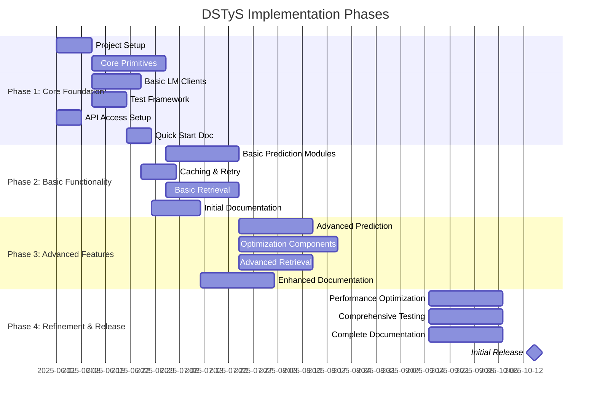
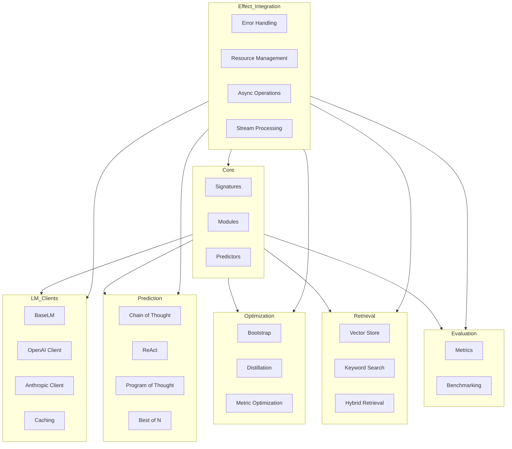
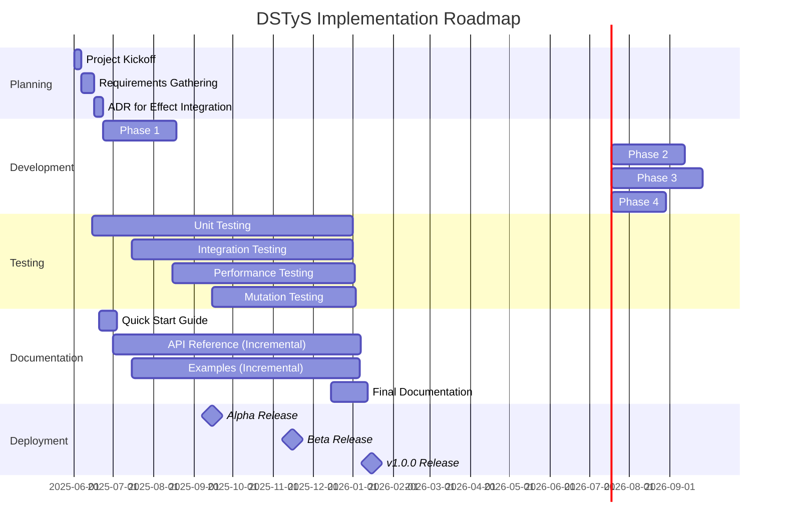

# Project Overview: DSTyS - DSPy in TypeScript with Effect

## Document Information
- **Project Name**: DSTyS (DSPy in TypeScript with Effect)
- **Document Version**: 2.0
- **Last Updated**: 2025-05-20
- **Author(s)**: Codegen
- **Status**: Draft
- **Approvers**: [Project Stakeholders]

## 1. Project Summary

### 1.1 Overview
DSTyS is a TypeScript implementation of Stanford NLP's DSPy framework, leveraging the Effect library for functional programming paradigms. The project aims to bring the powerful programming model for foundation models (like GPT-4, Claude, etc.) to the TypeScript ecosystem, enabling developers to build robust, composable, and optimizable AI systems using idiomatic TypeScript. The implementation will achieve feature parity with the stable DSPy 2.6.x branch, ensuring that core capabilities of DSPy are available to TypeScript developers while maintaining a sustainable development pace.

### 1.2 Business Value
DSTyS delivers significant business value by:
- Enabling TypeScript developers to build AI systems without learning Python
- Providing a structured, programmatic approach to working with foundation models
- Improving maintainability and testability of AI systems
- Reducing development time through reusable, composable components
- Enabling systematic optimization of AI pipelines
- Bridging the gap between Python-based AI research and TypeScript-based application development

**Buy vs. Build Justification**:
Rather than relying on Python DSPy via microservices or WASM, a native TypeScript implementation offers several advantages:
- **Performance**: Direct integration eliminates cross-language overhead (≤5% latency compared to raw API calls)
- **Developer Experience**: Native TypeScript types provide better IDE support and compile-time safety
- **Ecosystem Integration**: Seamless integration with TypeScript/JavaScript tooling and libraries
- **Deployment Flexibility**: Simpler deployment without Python runtime dependencies
- **Maintenance**: Easier to maintain and extend by TypeScript developers without Python expertise

### 1.3 Key Objectives
- Implement feature parity with Python DSPy 2.6.x branch in TypeScript
- Integrate with Effect library for robust error handling and functional programming patterns
- Provide a type-safe API with proper TypeScript interfaces and types
- Support multiple foundation model providers (OpenAI, Anthropic, etc.)
- Implement comprehensive testing and evaluation framework
- Create detailed documentation and examples
- Build a community of contributors and users
- Establish a process for tracking upstream DSPy changes and selectively incorporating them

### 1.4 Success Criteria
Success for the DSTyS project will be measured by the following SMART criteria:

| Criterion | Metric | Target | Measurement Method |
|-----------|--------|--------|-------------------|
| Feature Parity | % of DSPy 2.6.x features implemented | 95%+ | Feature checklist with automated tests |
| Performance | Latency overhead vs. direct API calls | ≤5% | Benchmark suite comparing equivalent operations |
| Adoption | GitHub stars | 1000+ in first 6 months | GitHub metrics |
| Adoption | npm downloads | 10,000+ in first 6 months | npm statistics |
| Quality | Test coverage | >85% | Automated coverage reports |
| Quality | Critical bugs | Zero in production releases | Issue tracking |
| Documentation | Documentation coverage | 100% of public APIs | Documentation coverage tool |
| Community | Active contributors | 10+ regular contributors | GitHub contribution metrics |
| Community | Discord/Matrix members | 500+ members | Community platform metrics |

## 2. Dependencies and Prerequisites

### 2.1 System Dependencies
| Dependency | Version/Details | Purpose | Status |
|------------|----------------|---------|--------|
| Node.js | 20+ | Runtime environment | Available |
| TypeScript | 5.0+ | Primary programming language | Available |
| Effect | 3.15.2+ | Functional programming and error handling | Available |
| Zod | 3.0+ | Runtime type validation | Available |
| fp-ts | 2.0+ | Functional programming utilities | Available |
| Python DSPy | 2.6.24 | Reference implementation | Available |

### 2.2 Technical Prerequisites
- Understanding of the Python DSPy framework architecture and implementation
- Knowledge of TypeScript and functional programming concepts
- Familiarity with foundation model APIs (OpenAI, Anthropic, etc.)
- Development environment with Node.js and TypeScript
- Access to foundation model APIs for testing
- Understanding of test-driven development practices

### 2.3 External Dependencies
| External Dependency | Provider | Purpose | Integration Status | Priority |
|--------------------|----------|---------|-------------------|----------|
| OpenAI API | OpenAI | Access to GPT models | Phase 1 | High |
| Anthropic API | Anthropic | Access to Claude models | Phase 1 | High |
| Vector Databases | Various (Pinecone, Weaviate, etc.) | Storage for embeddings | Phase 2 | Medium |
| Embedding APIs | Various (OpenAI, Cohere, etc.) | Generation of embeddings | Phase 2 | Medium |
| Local Model Inference | Various (Ollama, LM Studio) | Local model execution | Phase 3 | Low |

### 2.4 Team Dependencies
| Team/Department | Dependency Description | Timeline | Status |
|----------------|------------------------|----------|--------|
| AI Research | Guidance on DSPy implementation details | Ongoing | Not Started |
| DevOps | CI/CD pipeline setup | Week 1-2 | Not Started |
| Documentation | Documentation review and feedback | Ongoing | Not Started |
| QA | Testing strategy and validation | Ongoing | Not Started |
| DevRel | Community engagement and education | From Phase 2 | Not Started |
## 3. Implementation Phases

### 3.1 Phase Overview
The implementation of DSTyS will be divided into four main phases, each building on the previous one to deliver a complete, production-ready library. The timeline has been adjusted to account for complexity, integration challenges, and buffer time for unexpected issues.

### 3.2 Phase 1: Core Foundation (8 weeks)
This phase focuses on establishing the core architecture and foundational components of the DSTyS library.

**Timeline**: 2025-06-01 - 2025-07-26

**Key Deliverables**:
- Project structure and build system setup
- Core primitives implementation (Signatures, Modules, Predictors)
- Basic language model client interfaces
- Test framework and CI/CD pipeline
- API access setup for OpenAI and Anthropic
- Architectural Decision Record (ADR) for Effect integration patterns
- "Hello World" ReAct example in README

**Exit Criteria**:
- Core primitives pass all unit tests
- Basic language model clients can interact with foundation models
- CI/CD pipeline is operational with GitHub Actions
- Project structure and architecture documentation is complete
- API keys and provider mocks are set up and working
- ADR for Effect integration patterns is approved
- Basic "Hello World" example is working and documented

### 3.3 Phase 2: Basic Functionality (8 weeks)
This phase builds on the core foundation to implement basic functionality required for simple AI pipelines.

**Timeline**: 2025-07-27 - 2025-09-20

**Key Deliverables**:
- Basic prediction modules (Predict, ChainOfThought, etc.)
- Caching and retry mechanisms
- Basic retrieval components
- Initial documentation with examples
- Contract tests between components
- Community engagement channels (Discord/Matrix)

**Exit Criteria**:
- Basic prediction modules pass all unit and integration tests
- Caching and retry mechanisms work as expected
- Basic retrieval components can retrieve relevant information
- Initial documentation covers all implemented features
- Contract tests verify component interactions
- Community channels are set up and active

### 3.4 Phase 3: Advanced Features (10 weeks)
This phase implements advanced features required for complex AI pipelines and optimization.

**Timeline**: 2025-09-21 - 2025-11-29

**Key Deliverables**:
- Advanced prediction modules (ReAct, ProgramOfThought, etc.)
- Optimization components (Bootstrapping, Distillation, etc.)
- Advanced retrieval components
- Enhanced documentation with comprehensive examples
- Mutation testing and differential fuzzing setup
- Parity checklist vs. DSPy with CI status badge

**Exit Criteria**:
- Advanced prediction modules pass all unit and integration tests
- Optimization components can improve pipeline performance
- Advanced retrieval components work with various vector databases
- Documentation covers all advanced features with examples
- Mutation testing and differential fuzzing are operational
- Parity checklist is published and tracked in CI

### 3.5 Phase 4: Refinement and Release (6 weeks)
This phase focuses on refining the library, optimizing performance, and preparing for the initial release.

**Timeline**: 2025-11-30 - 2026-01-10

**Key Deliverables**:
- Performance optimizations
- Comprehensive test suite
- Complete documentation
- Initial release package
- Token usage monitoring and alerts
- Data handling guidelines for compliance

**Exit Criteria**:
- Performance meets or exceeds targets (≤5% overhead)
- Test coverage is > 85%
- Documentation is complete and accurate
- Initial release is published to npm
- Token usage monitoring is operational
- Data handling guidelines are published

## 4. Major Components

### 4.1 Component Overview
The DSTyS library consists of several major components that work together to provide a comprehensive framework for building AI systems.

### 4.2 Component 1: Core Primitives
The Core Primitives component provides the foundational building blocks for the DSTyS library.

**Purpose**: Define the core abstractions and interfaces that form the foundation of the DSTyS library.

**Key Functionality**:
- Signatures: Define input and output types for modules
- Modules: Composable units of functionality
- Predictors: Components that interact with foundation models
- Type handling: Support for complex nested types and validation

**Interfaces**:
- **Input**: TypeScript type definitions, Effect integration
- **Output**: Exported classes and interfaces for building AI pipelines

**Effect Integration Patterns**:
- Error handling using Effect's `Either` type for recoverable errors
- Resource management using Effect's `Scope` for proper cleanup
- Async operations using Effect's `Effect` type for composable async flows
- Stream processing using Effect's `Stream` type for handling streaming responses

**Contract Testing Strategy**:
- Snapshot tests for type signatures
- Unit tests for core functionality
- Property-based tests for type transformations
- Contract tests between interacting components

### 4.3 Component 2: Language Model Clients
The Language Model Clients component provides interfaces for interacting with foundation models.

**Purpose**: Provide a unified interface for interacting with various foundation model providers.

**Key Functionality**:
- Base LM interface: Common interface for all LM clients
- Provider-specific clients: OpenAI, Anthropic, etc.
- Caching: Caching of LM responses for efficiency
- Retry logic: Handling of transient errors

**Interfaces**:
- **Input**: Prompts, parameters, and configuration
- **Output**: Model responses, tokens, and metadata

**Effect Integration Patterns**:
- Error handling using Effect's `Either` type for API errors
- Resource management using Effect's `Scope` for connection pooling
- Retry logic using Effect's `Schedule` for exponential backoff
- Stream handling using Effect's `Stream` for streaming responses

**Contract Testing Strategy**:
- Mock LM clients for testing
- Contract tests between LM clients and modules
- Integration tests with real APIs (using recorded responses)
- Performance benchmarks against direct API calls
### 4.4 Component 3: Prediction Modules
The Prediction Modules component provides various prediction strategies for interacting with foundation models.

**Purpose**: Provide a set of prediction strategies for different use cases.

**Key Functionality**:
- Chain of Thought: Step-by-step reasoning
- ReAct: Reasoning and acting
- Program of Thought: Structured reasoning with code
- Best of N: Selecting the best response from multiple attempts

**Interfaces**:
- **Input**: Prompts, parameters, and configuration
- **Output**: Structured responses based on the prediction strategy

**Effect Integration Patterns**:
- Error handling using Effect's `Either` type for prediction errors
- Parallel execution using Effect's `all` for concurrent predictions
- Retry logic using Effect's `retry` for failed predictions
- Stream processing using Effect's `Stream` for streaming predictions

**Contract Testing Strategy**:
- Unit tests for prediction strategies
- Integration tests with mock LM clients
- Contract tests between prediction modules and other components
- Snapshot tests for prediction outputs

### 4.5 Component 4: Optimization Components
The Optimization Components provide tools for optimizing AI pipelines.

**Purpose**: Enable systematic improvement of AI pipelines through optimization techniques.

**Key Functionality**:
- Bootstrapping: Improving prompts through self-improvement
- Distillation: Transferring knowledge from complex to simpler models
- Metric-guided optimization: Optimizing based on specific metrics

**Interfaces**:
- **Input**: Modules, evaluation criteria, and optimization parameters
- **Output**: Optimized modules and prompts

**Effect Integration Patterns**:
- Error handling using Effect's `Either` type for optimization errors
- Resource management using Effect's `Scope` for optimization resources
- Parallel execution using Effect's `all` for concurrent optimizations
- Cancellation using Effect's `interrupt` for long-running optimizations

**Contract Testing Strategy**:
- Unit tests for optimization algorithms
- Integration tests with mock modules
- Performance tests for optimization speed
- Snapshot tests for optimization results

### 4.6 Component 5: Retrieval Components
The Retrieval Components provide tools for retrieving relevant information for AI pipelines.

**Purpose**: Enable retrieval of relevant information to enhance AI pipeline outputs.

**Key Functionality**:
- Vector store integration: Integration with vector databases
- Keyword search: Text-based search
- Hybrid retrieval: Combination of vector and keyword search

**Interfaces**:
- **Input**: Queries, parameters, and configuration
- **Output**: Retrieved documents and metadata

**Effect Integration Patterns**:
- Error handling using Effect's `Either` type for retrieval errors
- Resource management using Effect's `Scope` for database connections
- Parallel execution using Effect's `all` for concurrent retrievals
- Caching using Effect's `Cache` for efficient retrievals

**Contract Testing Strategy**:
- Unit tests for retrieval algorithms
- Integration tests with mock databases
- Performance tests for retrieval speed
- Contract tests between retrieval components and other modules

## 5. Implementation Chunks

### 5.1 Chunk Overview
The implementation is divided into logical chunks, each focusing on a specific aspect of the DSTyS library. These chunks are organized to minimize dependencies and enable parallel development where possible.

| Chunk ID | Chunk Name | Phase | Estimated Effort (Person-Days) | Dependencies |
|----------|------------|-------|--------------------------------|--------------|
| C1 | Project Setup | 1 | 10 | None |
| C2 | Core Primitives | 1 | 25 | C1 |
| C3 | Basic LM Clients | 1 | 15 | C1 |
| C4 | Test Framework | 1 | 10 | C1 |
| C5 | Basic Prediction Modules | 2 | 25 | C2, C3 |
| C6 | Caching & Retry | 2 | 10 | C3 |
| C7 | Basic Retrieval | 2 | 20 | C2 |
| C8 | Advanced Prediction | 3 | 25 | C5 |
| C9 | Advanced Retrieval | 3 | 20 | C7 |
| C10 | Optimization Components | 3 | 30 | C5, C11 |
| C11 | Evaluation Components | 3 | 15 | C5 |
| C12 | Performance Optimization | 4 | 15 | All |
| C13 | Documentation and Examples | All | 30 | Incremental |
| C14 | CI/CD and DevOps | All | 15 | Incremental |
| C15 | Compliance and Security | 4 | 10 | All |

### 5.2 Chunk 1: Project Setup
This chunk focuses on setting up the project infrastructure and development environment.

**Description**: Set up the project structure, build system, and development environment.

**Component(s)**: All

**Phase**: Phase 1: Core Foundation

**Estimated Effort**: Medium (10 person-days)

**Dependencies**: None

**Acceptance Criteria**:
- Project structure is set up
- Build system is configured
- Development environment is documented
- CI/CD pipeline is set up
- Code style and linting rules are established
- Initial README is created

### 5.3 Chunk 2: Core Primitives
This chunk implements the core primitives of the DSTyS library.

**Description**: Implement the core primitives that form the foundation of the DSTyS library.

**Component(s)**: Core Primitives

**Phase**: Phase 1: Core Foundation

**Estimated Effort**: Very High (25 person-days)

**Dependencies**: Project Setup

**Acceptance Criteria**:
- Signatures are implemented correctly
- Modules are implemented correctly
- Predictors are implemented correctly
- Type handling is implemented correctly
- Unit tests pass with > 90% coverage
- ADR for Effect integration patterns is created and approved

### 5.4 Chunk 3: Basic LM Clients
This chunk implements the basic language model clients for interacting with foundation models.

**Description**: Implement the basic language model clients for OpenAI and Anthropic.

**Component(s)**: Language Model Clients

**Phase**: Phase 1: Core Foundation

**Estimated Effort**: High (15 person-days)

**Dependencies**: Project Setup

**Acceptance Criteria**:
- Base LM interface is implemented correctly
- OpenAI client is implemented correctly
- Anthropic client is implemented correctly
- Error handling is implemented correctly
- Unit tests pass with > 90% coverage
- Integration tests with mock APIs pass
### 5.5 Chunk 4: Test Framework
This chunk implements the test framework for the DSTyS library.

**Description**: Implement a comprehensive test framework for the DSTyS library.

**Component(s)**: All

**Phase**: Phase 1: Core Foundation

**Estimated Effort**: Medium (10 person-days)

**Dependencies**: Project Setup

**Acceptance Criteria**:
- Unit testing framework is set up
- Integration testing framework is set up
- Mock LM clients are implemented
- CI/CD integration is configured
- Test coverage reporting is set up
- Test documentation is created

### 5.6 Chunk 5: Basic Prediction Modules
This chunk implements the basic prediction modules for the DSTyS library.

**Description**: Implement the basic prediction modules for the DSTyS library.

**Component(s)**: Prediction Modules

**Phase**: Phase 2: Basic Functionality

**Estimated Effort**: Very High (25 person-days)

**Dependencies**: Core Primitives, Basic LM Clients

**Acceptance Criteria**:
- Chain of Thought is implemented correctly
- Basic prediction modules are implemented correctly
- Error handling is implemented correctly
- Unit tests pass with > 90% coverage
- Integration tests with mock LM clients pass
- Contract tests with other components pass

### 5.7 Chunk 6: Caching & Retry
This chunk implements caching and retry mechanisms for the DSTyS library.

**Description**: Implement caching and retry mechanisms for the DSTyS library.

**Component(s)**: Language Model Clients

**Phase**: Phase 2: Basic Functionality

**Estimated Effort**: Medium (10 person-days)

**Dependencies**: Basic LM Clients

**Acceptance Criteria**:
- Caching is implemented correctly
- Retry logic is implemented correctly
- Error handling is implemented correctly
- Unit tests pass with > 90% coverage
- Integration tests pass
- Performance tests show improved efficiency

### 5.8 Chunk 7: Basic Retrieval
This chunk implements basic retrieval components for the DSTyS library.

**Description**: Implement basic retrieval components for the DSTyS library.

**Component(s)**: Retrieval Components

**Phase**: Phase 2: Basic Functionality

**Estimated Effort**: High (20 person-days)

**Dependencies**: Core Primitives

**Acceptance Criteria**:
- Vector store integration is implemented correctly
- Keyword search is implemented correctly
- Error handling is implemented correctly
- Unit tests pass with > 90% coverage
- Integration tests with mock databases pass
- Contract tests with other components pass

### 5.9 Chunk 8: Advanced Prediction
This chunk implements advanced prediction modules for the DSTyS library.

**Description**: Implement advanced prediction modules for the DSTyS library.

**Component(s)**: Prediction Modules

**Phase**: Phase 3: Advanced Features

**Estimated Effort**: Very High (25 person-days)

**Dependencies**: Basic Prediction Modules

**Acceptance Criteria**:
- ReAct is implemented correctly
- Program of Thought is implemented correctly
- Best of N is implemented correctly
- Error handling is implemented correctly
- Unit tests pass with > 90% coverage
- Integration tests with mock LM clients pass
- Contract tests with other components pass

### 5.10 Chunk 9: Advanced Retrieval
This chunk implements advanced retrieval components for the DSTyS library.

**Description**: Implement advanced retrieval components for the DSTyS library.

**Component(s)**: Retrieval Components

**Phase**: Phase 3: Advanced Features

**Estimated Effort**: High (20 person-days)

**Dependencies**: Basic Retrieval

**Acceptance Criteria**:
- Hybrid retrieval is implemented correctly
- Integration with vector databases is implemented correctly
- Advanced retrieval strategies are implemented correctly
- Unit tests pass with > 90% coverage
- Integration tests with mock databases pass
- Contract tests with other components pass

### 5.11 Chunk 10: Optimization Components
This chunk implements optimization components for the DSTyS library.

**Description**: Implement optimization components for the DSTyS library.

**Component(s)**: Optimization Components

**Phase**: Phase 3: Advanced Features

**Estimated Effort**: Very High (30 person-days)

**Dependencies**: Basic Prediction Modules, Evaluation Components

**Acceptance Criteria**:
- Bootstrapping is implemented correctly
- Distillation is implemented correctly
- Metric-guided optimization is implemented correctly
- Error handling is implemented correctly
- Unit tests pass with > 90% coverage
- Integration tests pass
- Performance tests show improved results

### 5.12 Chunk 11: Evaluation Components
This chunk implements evaluation components for the DSTyS library.

**Description**: Implement evaluation components for the DSTyS library.

**Component(s)**: Evaluation Components

**Phase**: Phase 3: Advanced Features

**Estimated Effort**: High (15 person-days)

**Dependencies**: Basic Prediction Modules

**Acceptance Criteria**:
- Metrics are implemented correctly
- Evaluator framework is implemented correctly
- Benchmarking tools are implemented correctly
- Error handling is implemented correctly
- Unit tests pass with > 90% coverage
- Integration tests pass
- Performance tests show accurate results

### 5.13 Chunk 12: Performance Optimization
This chunk focuses on optimizing the performance of the DSTyS library.

**Description**: Optimize the performance of the DSTyS library.

**Component(s)**: All

**Phase**: Phase 4: Refinement and Release

**Estimated Effort**: High (15 person-days)

**Dependencies**: All previous chunks

**Acceptance Criteria**:
- Performance meets or exceeds targets (≤5% overhead)
- No regressions in functionality
- Benchmarks show improvement
- Unit and integration tests pass with > 90% coverage
- Performance test suite is comprehensive

### 5.14 Chunk 13: Documentation and Examples
This chunk focuses on creating comprehensive documentation and examples for the DSTyS library.

**Description**: Create comprehensive documentation and examples for the DSTyS library.

**Component(s)**: All

**Phase**: All phases (incremental)

**Estimated Effort**: Very High (30 person-days)

**Dependencies**: Incremental based on implemented features

**Acceptance Criteria**:
- Documentation covers all features
- Examples demonstrate key use cases
- API reference is complete and accurate
- Documentation is clear and accessible
- Documentation coverage tool shows 100% coverage of public APIs
- "Hello World" ReAct example is included in README by Phase 1

### 5.15 Chunk 14: CI/CD and DevOps
This chunk focuses on setting up and maintaining the CI/CD pipeline and DevOps infrastructure.

**Description**: Set up and maintain the CI/CD pipeline and DevOps infrastructure.

**Component(s)**: All

**Phase**: All phases (incremental)

**Estimated Effort**: High (15 person-days)

**Dependencies**: Incremental based on implemented features

**Acceptance Criteria**:
- CI/CD pipeline is fully automated
- GitHub Actions workflows are configured correctly
- Semantic release is configured correctly
- Code quality checks are automated
- Test coverage reporting is automated
- Deployment to npm is automated
- Token usage monitoring is implemented

### 5.16 Chunk 15: Compliance and Security
This chunk focuses on ensuring compliance and security for the DSTyS library.

**Description**: Ensure compliance and security for the DSTyS library.

**Component(s)**: All

**Phase**: Phase 4: Refinement and Release

**Estimated Effort**: Medium (10 person-days)

**Dependencies**: All previous chunks

**Acceptance Criteria**:
- Data handling guidelines are published
- PII handling is implemented correctly
- GDPR compliance is documented
- Security best practices are implemented
- Token usage monitoring and alerts are operational
- License compatibility is confirmed and documented

## 6. Risk Assessment

### 6.1 Risk Overview
The DSTyS project faces several categories of risks, including technical risks related to the complexity of porting Python patterns to TypeScript, schedule risks due to the ambitious scope, and resource risks related to the specialized knowledge required. This section identifies key risks and outlines mitigation strategies.

### 6.2 Risk Matrix
| Risk ID | Risk Description | Likelihood (L/M/H) | Impact (L/M/H) | Risk Level | Mitigation Strategy | Owner |
|---------|------------------|-------------------|----------------|------------|---------------------|-------|
| R1 | Difficulty translating Python metaprogramming to TypeScript | H | H | High | Start with core functionality, use adapters for complex patterns, thorough testing | Tech Lead |
| R2 | API changes in foundation models | M | H | High | Design flexible interfaces, monitor for changes, implement adapters | Integration Lead |
| R3 | Performance issues compared to Python implementation | M | M | Medium | Early performance testing, optimization strategies, caching | Performance Lead |
| R4 | Scope creep due to DSPy feature additions | M | M | Medium | Clear version mapping to DSPy 2.6.x, prioritize core features, regular synchronization | Project Manager |
| R5 | Insufficient test coverage leading to bugs | M | H | High | Test-driven development, automated coverage checks, comprehensive test suite | QA Lead |
| R6 | Dependency on external services for testing | H | M | High | Mock external services, implement fallbacks, dedicated test environments | DevOps Lead |
| R7 | Documentation gaps leading to poor adoption | M | H | High | Documentation-driven development, user feedback, comprehensive examples | Documentation Lead |
| R8 | Resource constraints due to specialized knowledge requirements | H | M | High | Knowledge sharing sessions, detailed documentation, pair programming | Project Manager |
| R9 | PII/Data privacy concerns with foundation models | M | H | High | Implement data handling guidelines, PII detection, compliance documentation | Security Lead |
| R10 | API cost overruns during development and testing | H | M | High | Token usage monitoring, budget alerts, caching strategies, mock services | DevOps Lead |
### 6.3 Technical Risks
| Risk ID | Technical Risk | Mitigation Strategy |
|---------|---------------|---------------------|
| TR1 | Dynamic vs Static Typing challenges | Leverage TypeScript's type system features, use generics and conditional types, implement runtime type checking |
| TR2 | Metaprogramming limitations in TypeScript | Use TypeScript decorators, type inference, and code generation where appropriate |
| TR3 | Effect integration complexity | Start with simple patterns, gradually introduce more complex ones, create ADR for Effect integration patterns |
| TR4 | Foundation model API inconsistencies | Abstract provider-specific details, implement adapters, thorough testing |
| TR5 | Performance overhead of type checking | Optimize critical paths, use runtime type checking selectively, benchmark performance |
| TR6 | Type-level edge cases | Implement mutation testing and differential fuzzing to catch subtle type-level bugs |
| TR7 | Streaming response handling | Use Effect's Stream type for handling streaming responses, implement proper backpressure |

### 6.4 Schedule Risks
| Risk ID | Schedule Risk | Mitigation Strategy |
|---------|--------------|---------------------|
| SR1 | Underestimation of complexity | Break down tasks into smaller chunks, regular progress reviews, adjust timeline as needed |
| SR2 | Dependency delays | Identify critical path dependencies, develop contingency plans, parallel work where possible |
| SR3 | Feature creep | Strict scope management, prioritize features, defer non-essential features to later releases |
| SR4 | Integration challenges taking longer than expected | Early integration testing, incremental integration, dedicated integration time |
| SR5 | Documentation taking longer than expected | Documentation-driven development, templates, parallel documentation work |
| SR6 | Unexpected API changes | Monitor provider announcements, design for flexibility, implement adapters |
| SR7 | Team member availability | Cross-training, documentation, flexible scheduling, buffer time in estimates |

### 6.5 Resource Risks
| Risk ID | Resource Risk | Mitigation Strategy |
|---------|--------------|---------------------|
| RR1 | Limited TypeScript expertise with functional programming | Training sessions, pair programming, external consultants if needed |
| RR2 | Limited DSPy expertise | Regular communication with DSPy team, thorough study of DSPy codebase, documentation |
| RR3 | Limited foundation model API access | Budget for API usage, caching strategies, mock services for testing, token usage monitoring |
| RR4 | Team member availability | Cross-training, documentation, flexible scheduling |
| RR5 | Limited testing resources | Automated testing, prioritize critical components, risk-based testing |
| RR6 | DevRel resources for community building | Allocate dedicated DevRel resources from Phase 2, leverage community contributions |
| RR7 | Budget constraints for API usage | Implement token usage monitoring, set budget alerts, optimize prompts for efficiency |

### 6.6 Compliance and Security Risks
| Risk ID | Compliance/Security Risk | Mitigation Strategy |
|---------|--------------------------|---------------------|
| CR1 | PII exposure in foundation model inputs/outputs | Implement PII detection and redaction, data handling guidelines |
| CR2 | GDPR compliance issues | Document data handling practices, implement data minimization, provide opt-out mechanisms |
| CR3 | API key management | Implement secure key management, use environment variables, rotate keys regularly |
| CR4 | Dependency vulnerabilities | Regular dependency scanning, automated updates, security reviews |
| CR5 | Data retention policies | Implement configurable data retention, document best practices |
| CR6 | Cross-border data transfer | Document data flow, implement regional endpoints where possible |
| CR7 | Prompt injection vulnerabilities | Implement input validation, sanitization, and monitoring |

## 7. Implementation Roadmap

### 7.1 High-Level Timeline

### 7.2 Key Milestones
| Milestone | Description | Target Date | Dependencies |
|-----------|-------------|-------------|--------------|
| M1 | Project Kickoff | 2025-06-01 | None |
| M2 | ADR for Effect Integration Approved | 2025-06-15 | Project Kickoff |
| M3 | Core Foundation Complete | 2025-07-26 | Project Setup |
| M4 | "Hello World" ReAct Example | 2025-07-15 | Core Primitives |
| M5 | Basic Functionality Complete | 2025-09-20 | Core Foundation |
| M6 | Alpha Release | 2025-09-15 | Basic Functionality |
| M7 | Advanced Features Complete | 2025-11-29 | Basic Functionality |
| M8 | Beta Release | 2025-11-15 | Advanced Features |
| M9 | Refinement Complete | 2026-01-10 | Advanced Features |
| M10 | v1.0.0 Release | 2026-01-15 | Refinement |

### 7.3 Resource Allocation
| Role | Phase 1 | Phase 2 | Phase 3 | Phase 4 | Total Allocation |
|------|---------|---------|---------|---------|------------------|
| Tech Lead | 100% | 75% | 75% | 75% | 81% |
| TypeScript Developer 1 | 100% | 100% | 100% | 75% | 94% |
| TypeScript Developer 2 | 100% | 100% | 100% | 75% | 94% |
| AI Specialist | 50% | 75% | 100% | 50% | 69% |
| QA Engineer | 25% | 50% | 75% | 100% | 63% |
| Documentation Specialist | 25% | 50% | 75% | 100% | 63% |
| DevOps Engineer | 50% | 25% | 25% | 50% | 38% |
| DevRel Specialist | 0% | 50% | 75% | 100% | 56% |
| Security Specialist | 25% | 25% | 50% | 75% | 44% |

### 7.4 Must-Ship v0.1 Feature Subset
To ensure a realistic timeline and deliverable scope, the following features are identified as the "must-ship" subset for v0.1:

| Feature | Description | Priority |
|---------|-------------|----------|
| Core Primitives | Basic signatures, modules, and predictors | High |
| OpenAI Client | Basic integration with OpenAI API | High |
| Anthropic Client | Basic integration with Anthropic API | High |
| Chain of Thought | Basic chain of thought prediction | High |
| Basic Retrieval | Simple vector store integration | Medium |
| Effect Integration | Basic error handling and async operations | High |
| Documentation | Quick start guide and API reference | High |
| Testing | Unit and integration tests for core features | High |

This subset provides a functional foundation that developers can start using while more advanced features are being developed.

## 8. Appendices

### 8.1 Glossary
| Term | Definition |
|------|------------|
| DSPy | Declarative Self-improving Python, a framework for programming foundation models |
| Effect | A TypeScript library for functional programming with robust error handling |
| Foundation Model | Large language models like GPT-4, Claude, etc. that serve as the base for AI applications |
| RAG | Retrieval-Augmented Generation, a technique for enhancing LLM outputs with retrieved information |
| LLM | Large Language Model, a type of AI model trained on vast amounts of text data |
| ADR | Architectural Decision Record, a document capturing important architectural decisions |
| Mutation Testing | Testing technique that introduces small changes to code to test the quality of tests |
| Differential Fuzzing | Testing technique that compares outputs of different implementations with random inputs |
| PII | Personally Identifiable Information, data that could identify an individual |
| GDPR | General Data Protection Regulation, EU data protection and privacy regulation |

### 8.2 References
- [DSPy GitHub Repository](https://github.com/stanfordnlp/dspy) - MIT License, v2.6.24
- [DSPy Documentation](https://dspy.ai/)
- [Effect Documentation](https://effect.website/) - MIT License, v3.15.2
- [DSPy Paper: Compiling Declarative Language Model Calls into Self-Improving Pipelines](https://arxiv.org/abs/2310.03714)
- [DSTyS Product Requirements Document](./DSTyS_Product_Requirements_Document.md)
- [DSTyS Architecture Document](./DSTyS_Architecture_Document.md)
- [Stryker Mutator for TypeScript](https://stryker-mutator.io/docs/stryker-js/introduction/)
- [Fast-Check Property Testing](https://github.com/dubzzz/fast-check)
- [GDPR Compliance for AI Systems](https://www.edps.europa.eu/system/files/2024-06/24-06-03_genai_orientations_en.pdf)
- [Token Usage Monitoring Best Practices](https://www.finops.org/wg/how-to-build-a-generative-ai-cost-and-usage-tracker/)

### 8.3 Revision History
| Version | Date | Author | Description of Changes |
|---------|------|--------|------------------------|
| 1.0 | 2025-05-20 | Codegen | Initial version |
| 2.0 | 2025-05-20 | Codegen | Comprehensive revision based on feedback: adjusted scope to DSPy 2.6.x, added buy vs. build justification, quantified metrics, revised timeline, added ADR for Effect integration, added contract testing strategy, expanded compliance and security considerations, added must-ship feature subset |
