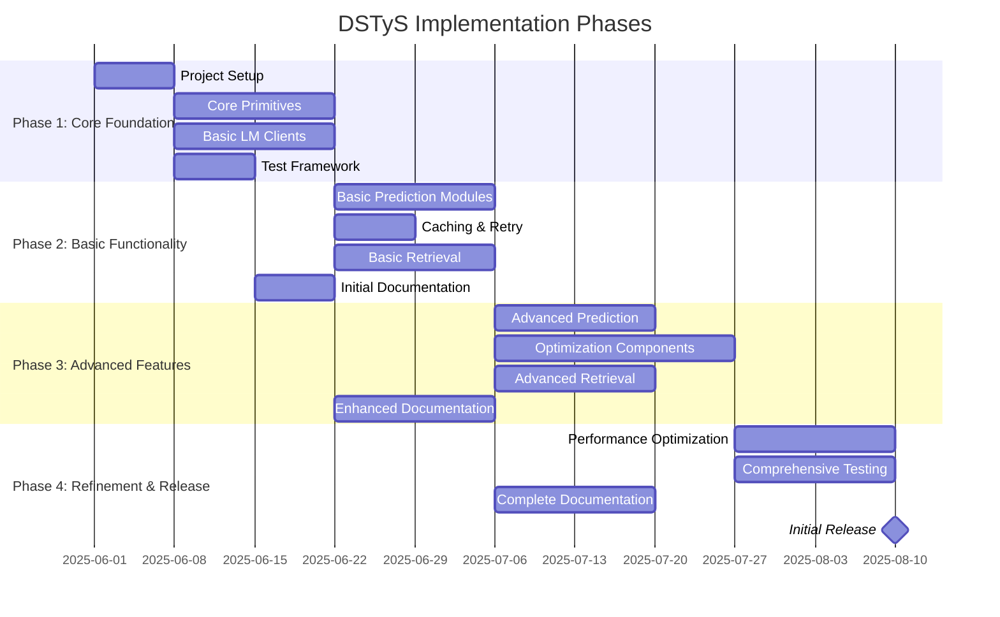
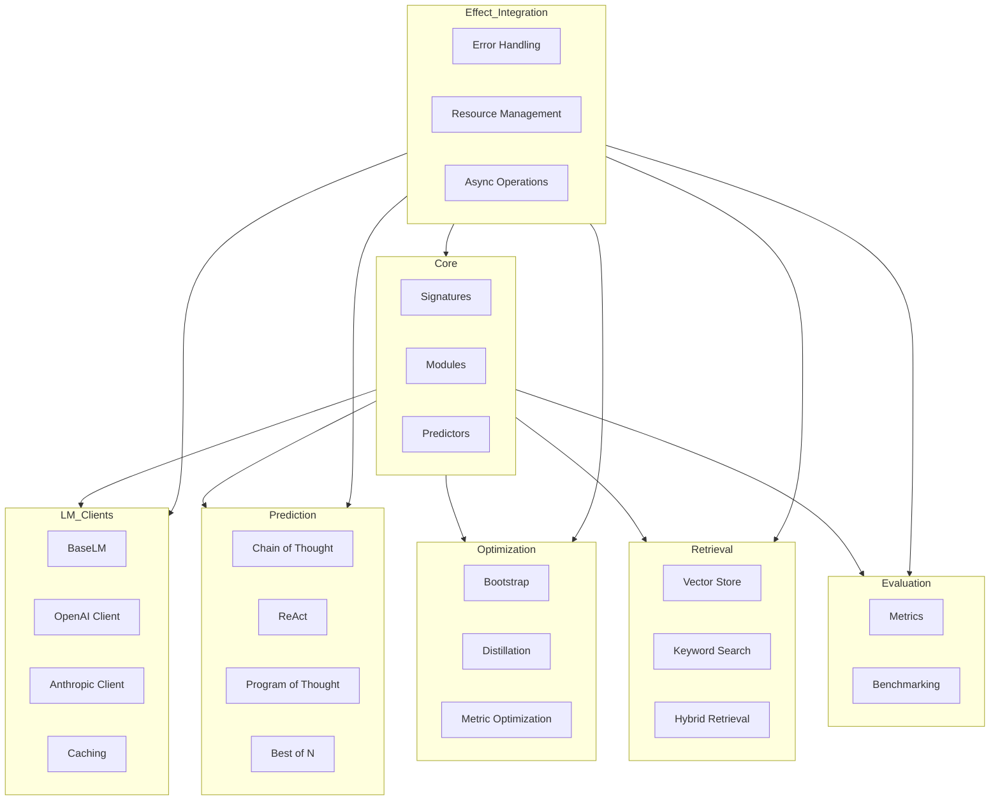
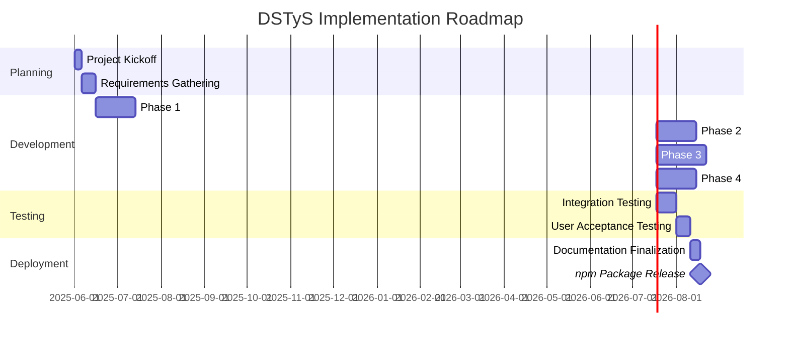

# Project Overview: DSTyS - DSPy in TypeScript with Effect

## Document Information
- **Project Name**: DSTyS (DSPy in TypeScript with Effect)
- **Document Version**: 1.0
- **Last Updated**: 2025-05-20
- **Author(s)**: Codegen
- **Status**: Draft
- **Approvers**: [Project Stakeholders]

## 1. Project Summary

### 1.1 Overview
DSTyS is a TypeScript implementation of Stanford NLP's DSPy framework, leveraging the Effect library for functional programming paradigms. The project aims to bring the powerful programming model for foundation models (like GPT-4, Claude, etc.) to the TypeScript ecosystem, enabling developers to build robust, composable, and optimizable AI systems using idiomatic TypeScript. The implementation will achieve 100% feature parity with the Python version, ensuring that all capabilities of DSPy are available to TypeScript developers.

### 1.2 Business Value
DSTyS delivers significant business value by:
- Enabling TypeScript developers to build AI systems without learning Python
- Providing a structured, programmatic approach to working with foundation models
- Improving maintainability and testability of AI systems
- Reducing development time through reusable, composable components
- Enabling systematic optimization of AI pipelines
- Bridging the gap between Python-based AI research and TypeScript-based application development

### 1.3 Key Objectives
- Implement 100% feature parity with Python DSPy in TypeScript
- Integrate with Effect library for robust error handling and functional programming patterns
- Provide a type-safe API with proper TypeScript interfaces and types
- Support multiple foundation model providers (OpenAI, Anthropic, etc.)
- Implement comprehensive testing and evaluation framework
- Create detailed documentation and examples
- Build a community of contributors and users

### 1.4 Success Criteria
Success for the DSTyS project will be measured by:
- Feature parity: 100% of DSPy features implemented in TypeScript
- Performance: Minimal overhead compared to direct API calls to foundation models
- Adoption: Number of GitHub stars, downloads, and active contributors
- Quality: Test coverage > 80%, zero critical bugs
- Documentation: Comprehensive documentation with examples for all features
- Community: Active community of contributors and users

## 2. Dependencies and Prerequisites

### 2.1 System Dependencies
| Dependency | Version/Details | Purpose | Status |
|------------|----------------|---------|--------|
| Node.js | 20+ | Runtime environment | Available |
| TypeScript | 5.0+ | Primary programming language | Available |
| Effect | 2.0+ | Functional programming and error handling | Available |
| Zod | 3.0+ | Runtime type validation | Available |
| fp-ts | 2.0+ | Functional programming utilities | Available |
| Python DSPy | Latest | Reference implementation | Available |

### 2.2 Technical Prerequisites
- Understanding of the Python DSPy framework architecture and implementation
- Knowledge of TypeScript and functional programming concepts
- Familiarity with foundation model APIs (OpenAI, Anthropic, etc.)
- Development environment with Node.js and TypeScript
- Access to foundation model APIs for testing
- Understanding of test-driven development practices

### 2.3 External Dependencies
| External Dependency | Provider | Purpose | Integration Status |
|--------------------|----------|---------|-------------------|
| OpenAI API | OpenAI | Access to GPT models | Not Started |
| Anthropic API | Anthropic | Access to Claude models | Not Started |
| Vector Databases | Various (Pinecone, Weaviate, etc.) | Storage for embeddings | Not Started |
| Embedding APIs | Various (OpenAI, Cohere, etc.) | Generation of embeddings | Not Started |
| Local Model Inference | Various (Ollama, LM Studio) | Local model execution | Not Started |

### 2.4 Team Dependencies
| Team/Department | Dependency Description | Timeline | Status |
|----------------|------------------------|----------|--------|
| AI Research | Guidance on DSPy implementation details | Ongoing | Not Started |
| DevOps | CI/CD pipeline setup | Week 1-2 | Not Started |
| Documentation | Documentation review and feedback | Ongoing | Not Started |
| QA | Testing strategy and validation | Ongoing | Not Started |

## 3. Implementation Phases

### 3.1 Phase Overview
The implementation of DSTyS will be divided into four main phases, each building on the previous one to deliver a complete, production-ready library.

### 3.2 Phase 1: Core Foundation
This phase focuses on establishing the core architecture and foundational components of the DSTyS library.

**Timeline**: 2025-06-01 - 2025-06-28

**Key Deliverables**:
- Project structure and build system setup
- Core primitives implementation (Signatures, Modules, Predictors)
- Basic language model client interfaces
- Test framework and CI/CD pipeline

**Exit Criteria**:
- Core primitives pass all unit tests
- Basic language model clients can interact with foundation models
- CI/CD pipeline is operational
- Project structure and architecture documentation is complete

### 3.3 Phase 2: Basic Functionality
This phase builds on the core foundation to implement basic functionality required for simple AI pipelines.

**Timeline**: 2025-06-29 - 2025-07-26

**Key Deliverables**:
- Basic prediction modules (Predict, ChainOfThought, etc.)
- Caching and retry mechanisms
- Basic retrieval components
- Initial documentation with examples

**Exit Criteria**:
- Basic prediction modules pass all unit and integration tests
- Caching and retry mechanisms work as expected
- Basic retrieval components can retrieve relevant information
- Initial documentation covers all implemented features

### 3.4 Phase 3: Advanced Features
This phase implements advanced features required for complex AI pipelines and optimization.

**Timeline**: 2025-07-27 - 2025-08-30

**Key Deliverables**:
- Advanced prediction modules (ReAct, ProgramOfThought, etc.)
- Optimization components (Bootstrapping, Distillation, etc.)
- Advanced retrieval components
- Enhanced documentation with comprehensive examples

**Exit Criteria**:
- Advanced prediction modules pass all unit and integration tests
- Optimization components can improve pipeline performance
- Advanced retrieval components work with various vector databases
- Documentation covers all advanced features with examples

### 3.5 Phase 4: Refinement and Release
This phase focuses on refining the library, optimizing performance, and preparing for the initial release.

**Timeline**: 2025-08-31 - 2025-09-27

**Key Deliverables**:
- Performance optimizations
- Comprehensive test suite
- Complete documentation
- Initial release package

**Exit Criteria**:
- Performance meets or exceeds targets
- Test coverage is > 80%
- Documentation is complete and accurate
- Initial release is published to npm

## 4. Major Components

### 4.1 Component Overview
The DSTyS library consists of several major components that work together to provide a comprehensive framework for building AI systems.

### 4.2 Component 1: Core Primitives
The Core Primitives component provides the foundational building blocks for the DSTyS library.

**Purpose**: Define the core abstractions and interfaces that form the foundation of the DSTyS library.

**Key Functionality**:
- Signatures: Define input and output types for modules
- Modules: Composable units of functionality
- Predictors: Components that interact with foundation models
- Type handling: Support for complex nested types and validation

**Interfaces**:
- **Input**: TypeScript type definitions, Effect integration
- **Output**: Exported classes and interfaces for building AI pipelines
- **Dependencies**: Effect library, Zod for runtime type validation

### 4.3 Component 2: Language Model Clients
The Language Model Clients component provides interfaces for interacting with foundation models.

**Purpose**: Enable communication with various foundation model providers through a consistent interface.

**Key Functionality**:
- Abstract interfaces for foundation models
- Provider-specific implementations (OpenAI, Anthropic, etc.)
- Caching and retry mechanisms
- Error handling and rate limiting

**Interfaces**:
- **Input**: Prompts, parameters, and configuration
- **Output**: Model responses and embeddings
- **Dependencies**: Core Primitives, Effect for error handling and resource management

### 4.4 Component 3: Prediction Modules
The Prediction Modules component provides specialized modules for different prediction patterns.

**Purpose**: Implement various prediction strategies and patterns for working with foundation models.

**Key Functionality**:
- Basic prediction: Direct interaction with models
- Chain of Thought: Reasoning before answering
- ReAct: Reasoning and acting with tools
- Program of Thought: Code generation and execution
- Best of N: Multiple generations with selection

**Interfaces**:
- **Input**: Queries, context, and parameters
- **Output**: Structured responses based on the prediction pattern
- **Dependencies**: Core Primitives, Language Model Clients

### 4.5 Component 4: Optimization
The Optimization component provides tools for optimizing prompts and pipelines.

**Purpose**: Enable systematic improvement of AI pipelines through automated optimization techniques.

**Key Functionality**:
- Bootstrapping: Self-improvement through bootstrapping
- Distillation: Knowledge distillation techniques
- Metric-guided optimization: Optimization based on metrics
- Hyperparameter tuning: Automated tuning of parameters

**Interfaces**:
- **Input**: Pipelines, evaluation datasets, and metrics
- **Output**: Optimized pipelines and prompts
- **Dependencies**: Core Primitives, Prediction Modules, Evaluation

### 4.6 Component 5: Retrieval
The Retrieval component provides tools for retrieving relevant information to augment foundation model outputs.

**Purpose**: Enable retrieval-augmented generation (RAG) by integrating with various retrieval systems.

**Key Functionality**:
- Vector-based retrieval: Semantic search using embeddings
- Keyword-based retrieval: Traditional search techniques
- Hybrid retrieval: Combining multiple retrieval methods
- Integration with vector databases

**Interfaces**:
- **Input**: Queries, documents, and configuration
- **Output**: Retrieved documents and passages
- **Dependencies**: Core Primitives, Language Model Clients for embeddings

### 4.7 Component 6: Evaluation
The Evaluation component provides tools for evaluating and benchmarking AI pipelines.

**Purpose**: Enable systematic evaluation of AI pipelines to measure performance and identify areas for improvement.

**Key Functionality**:
- Metrics: Standard evaluation metrics
- Evaluator: Framework for systematic evaluation
- Benchmarking: Tools for benchmarking pipelines
- Comparison: Tools for comparing different pipelines

**Interfaces**:
- **Input**: Pipelines, evaluation datasets, and metrics
- **Output**: Evaluation results and benchmarks
- **Dependencies**: Core Primitives, Prediction Modules

### 4.8 Component 7: Effect Integration
The Effect Integration component provides integration with the Effect library for functional programming patterns and error handling.

**Purpose**: Enable robust error handling, resource management, and functional programming patterns throughout the library.

**Key Functionality**:
- Error handling: Tagged errors and recovery mechanisms
- Resource management: Scoped resources and cleanup
- Asynchronous operations: Composition and cancellation
- Testing: Tools for testing Effect-based code

**Interfaces**:
- **Input**: Effect primitives and patterns
- **Output**: Effect-based implementations of DSTyS components
- **Dependencies**: Effect library, fp-ts

## 5. Implementation Chunks

### 5.1 Chunk Overview
The implementation is broken down into manageable chunks based on the major components and their dependencies. Each chunk represents a specific unit of work that can be implemented and tested independently. The chunks are organized by component and phase to ensure a logical progression of development.

### 5.2 Chunk 1: Core Signatures Implementation
This chunk implements the core Signature system that defines input and output types for modules.

**Description**: Implement the Signature system that allows defining structured inputs and outputs for modules, including field definitions, validation, and type safety.

**Component(s)**: Core Primitives

**Phase**: Phase 1: Core Foundation

**Estimated Effort**: High (10 person-days)

**Dependencies**:
- Project setup
- Effect library integration

**Acceptance Criteria**:
- Signatures can define complex nested types
- Runtime validation works correctly
- TypeScript type inference works correctly
- Unit tests pass with > 90% coverage

### 5.3 Chunk 2: Module System Implementation
This chunk implements the core Module system that provides the foundation for building composable AI pipelines.

**Description**: Implement the Module system that allows defining reusable, composable units of functionality with typed inputs and outputs.

**Component(s)**: Core Primitives

**Phase**: Phase 1: Core Foundation

**Estimated Effort**: High (10 person-days)

**Dependencies**:
- Core Signatures Implementation

**Acceptance Criteria**:
- Modules can be defined with typed inputs and outputs
- Modules can be composed together
- Effect integration works correctly
- Unit tests pass with > 90% coverage

### 5.4 Chunk 3: Basic Language Model Client Interface
This chunk implements the basic interface for interacting with foundation models.

**Description**: Implement the BaseLM interface and basic provider-specific implementations for OpenAI and Anthropic.

**Component(s)**: Language Model Clients

**Phase**: Phase 1: Core Foundation

**Estimated Effort**: Medium (7 person-days)

**Dependencies**:
- Project setup
- Effect library integration

**Acceptance Criteria**:
- BaseLM interface is well-defined
- OpenAI and Anthropic implementations work correctly
- Error handling is robust
- Unit tests pass with > 90% coverage

### 5.5 Chunk 4: Caching and Retry Mechanisms
This chunk implements caching and retry mechanisms for language model clients.

**Description**: Implement caching to reduce redundant API calls and retry mechanisms to handle transient errors.

**Component(s)**: Language Model Clients

**Phase**: Phase 2: Basic Functionality

**Estimated Effort**: Medium (5 person-days)

**Dependencies**:
- Basic Language Model Client Interface

**Acceptance Criteria**:
- Caching reduces redundant API calls
- Retry mechanisms handle transient errors
- Configuration options are flexible
- Unit tests pass with > 90% coverage

### 5.6 Chunk 5: Basic Prediction Modules
This chunk implements basic prediction modules like Predict and ChainOfThought.

**Description**: Implement the basic prediction modules that provide different strategies for interacting with foundation models.

**Component(s)**: Prediction Modules

**Phase**: Phase 2: Basic Functionality

**Estimated Effort**: High (10 person-days)

**Dependencies**:
- Module System Implementation
- Basic Language Model Client Interface

**Acceptance Criteria**:
- Predict module works correctly
- ChainOfThought module works correctly
- Integration with language model clients is seamless
- Unit and integration tests pass with > 90% coverage

### 5.7 Chunk 6: Advanced Prediction Modules
This chunk implements advanced prediction modules like ReAct and ProgramOfThought.

**Description**: Implement advanced prediction modules that provide more sophisticated strategies for interacting with foundation models.

**Component(s)**: Prediction Modules

**Phase**: Phase 3: Advanced Features

**Estimated Effort**: High (15 person-days)

**Dependencies**:
- Basic Prediction Modules

**Acceptance Criteria**:
- ReAct module works correctly
- ProgramOfThought module works correctly
- BestOfN module works correctly
- Unit and integration tests pass with > 90% coverage

### 5.8 Chunk 7: Basic Retrieval Components
This chunk implements basic retrieval components for retrieving relevant information.

**Description**: Implement basic retrieval components that enable retrieval-augmented generation.

**Component(s)**: Retrieval

**Phase**: Phase 2: Basic Functionality

**Estimated Effort**: Medium (7 person-days)

**Dependencies**:
- Module System Implementation
- Basic Language Model Client Interface

**Acceptance Criteria**:
- Vector-based retrieval works correctly
- Keyword-based retrieval works correctly
- Integration with language model clients is seamless
- Unit and integration tests pass with > 90% coverage

### 5.9 Chunk 8: Advanced Retrieval Components
This chunk implements advanced retrieval components for more sophisticated retrieval strategies.

**Description**: Implement advanced retrieval components that enable more sophisticated retrieval-augmented generation.

**Component(s)**: Retrieval

**Phase**: Phase 3: Advanced Features

**Estimated Effort**: High (10 person-days)

**Dependencies**:
- Basic Retrieval Components

**Acceptance Criteria**:
- Hybrid retrieval works correctly
- Integration with vector databases works correctly
- Advanced retrieval strategies are implemented
- Unit and integration tests pass with > 90% coverage

### 5.10 Chunk 9: Optimization Components
This chunk implements optimization components for improving AI pipelines.

**Description**: Implement optimization components that enable systematic improvement of AI pipelines.

**Component(s)**: Optimization

**Phase**: Phase 3: Advanced Features

**Estimated Effort**: Very High (20 person-days)

**Dependencies**:
- Basic Prediction Modules
- Evaluation Components

**Acceptance Criteria**:
- Bootstrapping works correctly
- Distillation works correctly
- Metric-guided optimization works correctly
- Unit and integration tests pass with > 90% coverage

### 5.11 Chunk 10: Evaluation Components
This chunk implements evaluation components for measuring pipeline performance.

**Description**: Implement evaluation components that enable systematic evaluation of AI pipelines.

**Component(s)**: Evaluation

**Phase**: Phase 3: Advanced Features

**Estimated Effort**: Medium (7 person-days)

**Dependencies**:
- Basic Prediction Modules

**Acceptance Criteria**:
- Metrics are implemented correctly
- Evaluator framework works correctly
- Benchmarking tools work correctly
- Unit and integration tests pass with > 90% coverage

### 5.12 Chunk 11: Performance Optimization
This chunk focuses on optimizing the performance of the DSTyS library.

**Description**: Optimize the performance of the DSTyS library to minimize overhead compared to direct API calls.

**Component(s)**: All

**Phase**: Phase 4: Refinement and Release

**Estimated Effort**: High (10 person-days)

**Dependencies**:
- All previous chunks

**Acceptance Criteria**:
- Performance meets or exceeds targets
- No regressions in functionality
- Benchmarks show improvement
- Unit and integration tests pass with > 90% coverage

### 5.13 Chunk 12: Documentation and Examples
This chunk focuses on creating comprehensive documentation and examples.

**Description**: Create comprehensive documentation and examples for all features of the DSTyS library.

**Component(s)**: All

**Phase**: Phase 4: Refinement and Release

**Estimated Effort**: High (15 person-days)

**Dependencies**:
- All previous chunks

**Acceptance Criteria**:
- Documentation covers all features
- Examples demonstrate key use cases
- API reference is complete and accurate
- Documentation is clear and accessible

## 6. Risk Assessment

### 6.1 Risk Overview
The DSTyS project faces several categories of risks, including technical risks related to the complexity of porting Python patterns to TypeScript, schedule risks due to the ambitious scope, and resource risks related to the specialized knowledge required. This section identifies key risks and outlines mitigation strategies.

### 6.2 Risk Matrix
| Risk ID | Risk Description | Likelihood (L/M/H) | Impact (L/M/H) | Risk Level | Mitigation Strategy | Owner |
|---------|------------------|-------------------|----------------|------------|---------------------|-------|
| R1 | Difficulty translating Python metaprogramming to TypeScript | H | H | High | Start with core functionality, use adapters for complex patterns, thorough testing | Tech Lead |
| R2 | API changes in foundation models | M | H | High | Design flexible interfaces, monitor for changes, implement adapters | Integration Lead |
| R3 | Performance issues compared to Python implementation | M | M | Medium | Early performance testing, optimization strategies, caching | Performance Lead |
| R4 | Scope creep due to DSPy feature additions | M | M | Medium | Clear version mapping, prioritize core features, regular synchronization | Project Manager |
| R5 | Insufficient test coverage leading to bugs | M | H | High | Test-driven development, automated coverage checks, comprehensive test suite | QA Lead |
| R6 | Dependency on external services for testing | H | M | High | Mock external services, implement fallbacks, dedicated test environments | DevOps Lead |
| R7 | Documentation gaps leading to poor adoption | M | H | High | Documentation-driven development, user feedback, comprehensive examples | Documentation Lead |
| R8 | Resource constraints due to specialized knowledge requirements | H | M | High | Knowledge sharing sessions, detailed documentation, pair programming | Project Manager |

### 6.3 Technical Risks
| Risk ID | Technical Risk | Mitigation Strategy |
|---------|---------------|---------------------|
| TR1 | Dynamic vs Static Typing challenges | Leverage TypeScript's type system features, use generics and conditional types, implement runtime type checking |
| TR2 | Metaprogramming limitations in TypeScript | Use TypeScript decorators, type inference, and code generation where appropriate |
| TR3 | Effect integration complexity | Start with simple patterns, gradually introduce more complex ones, thorough testing |
| TR4 | Foundation model API inconsistencies | Abstract provider-specific details, implement adapters, thorough testing |
| TR5 | Performance overhead of type checking | Optimize critical paths, use runtime type checking selectively, benchmark performance |

### 6.4 Schedule Risks
| Risk ID | Schedule Risk | Mitigation Strategy |
|---------|--------------|---------------------|
| SR1 | Underestimation of complexity | Break down tasks into smaller chunks, regular progress reviews, adjust timeline as needed |
| SR2 | Dependency delays | Identify critical path dependencies, develop contingency plans, parallel work where possible |
| SR3 | Feature creep | Strict scope management, prioritize features, defer non-essential features to later releases |
| SR4 | Integration challenges taking longer than expected | Early integration testing, incremental integration, dedicated integration time |
| SR5 | Documentation taking longer than expected | Documentation-driven development, templates, parallel documentation work |

### 6.5 Resource Risks
| Risk ID | Resource Risk | Mitigation Strategy |
|---------|--------------|---------------------|
| RR1 | Limited TypeScript expertise with functional programming | Training sessions, pair programming, external consultants if needed |
| RR2 | Limited DSPy expertise | Regular communication with DSPy team, thorough study of DSPy codebase, documentation |
| RR3 | Limited foundation model API access | Budget for API usage, caching strategies, mock services for testing |
| RR4 | Team member availability | Cross-training, documentation, flexible scheduling |
| RR5 | Limited testing resources | Automated testing, prioritize critical components, risk-based testing |

## 7. Implementation Roadmap

### 7.1 High-Level Timeline

### 7.2 Key Milestones
| Milestone | Description | Target Date | Dependencies |
|-----------|-------------|-------------|--------------|
| M1 | Project Kickoff | 2025-06-01 | None |
| M2 | Core Foundation Complete | 2025-06-28 | Project Setup |
| M3 | Basic Functionality Complete | 2025-07-26 | Core Foundation |
| M4 | Advanced Features Complete | 2025-08-30 | Basic Functionality |
| M5 | Refinement Complete | 2025-09-27 | Advanced Features |
| M6 | Testing Complete | 2025-10-21 | Refinement |
| M7 | Initial Release | 2025-10-28 | Testing |

### 7.3 Resource Allocation
| Role | Phase 1 | Phase 2 | Phase 3 | Phase 4 | Total Allocation |
|------|---------|---------|---------|---------|------------------|
| Tech Lead | 100% | 75% | 50% | 75% | 75% |
| TypeScript Developer 1 | 100% | 100% | 100% | 75% | 94% |
| TypeScript Developer 2 | 100% | 100% | 100% | 75% | 94% |
| AI Specialist | 50% | 75% | 100% | 50% | 69% |
| QA Engineer | 25% | 50% | 75% | 100% | 63% |
| Documentation Specialist | 25% | 50% | 75% | 100% | 63% |
| DevOps Engineer | 50% | 25% | 25% | 50% | 38% |

## 8. Appendices

### 8.1 Glossary
| Term | Definition |
|------|------------|
| DSPy | Declarative Self-improving Python, a framework for programming foundation models |
| Effect | A TypeScript library for functional programming with robust error handling |
| Foundation Model | Large language models like GPT-4, Claude, etc. that serve as the base for AI applications |
| RAG | Retrieval-Augmented Generation, a technique for enhancing LLM outputs with retrieved information |
| LLM | Large Language Model, a type of AI model trained on vast amounts of text data |
| Prompt Engineering | The practice of crafting prompts to get desired outputs from foundation models |
| Metaprogramming | Programming techniques that treat programs as data to be manipulated |
| TDD | Test-Driven Development, a software development process relying on a short development cycle |

### 8.2 References
- [DSPy GitHub Repository](https://github.com/stanfordnlp/dspy)
- [DSPy Documentation](https://dspy.ai/)
- [Effect Documentation](https://effect.website/)
- [DSPy Paper: Compiling Declarative Language Model Calls into Self-Improving Pipelines](https://arxiv.org/abs/2310.03714)
- [DSTyS Product Requirements Document](./DSTyS_Product_Requirements_Document.md)
- [DSTyS Architecture Document](./DSTyS_Architecture_Document.md)

### 8.3 Revision History
| Version | Date | Author | Description of Changes |
|---------|------|--------|------------------------|
| 1.0 | 2025-05-20 | Codegen | Initial version |

