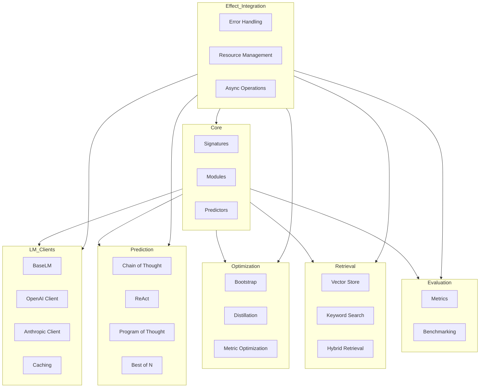
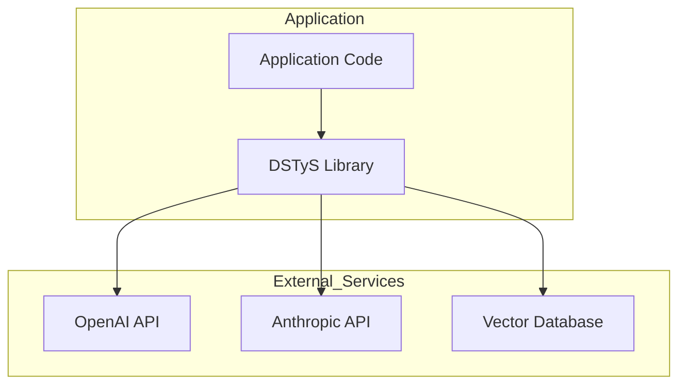
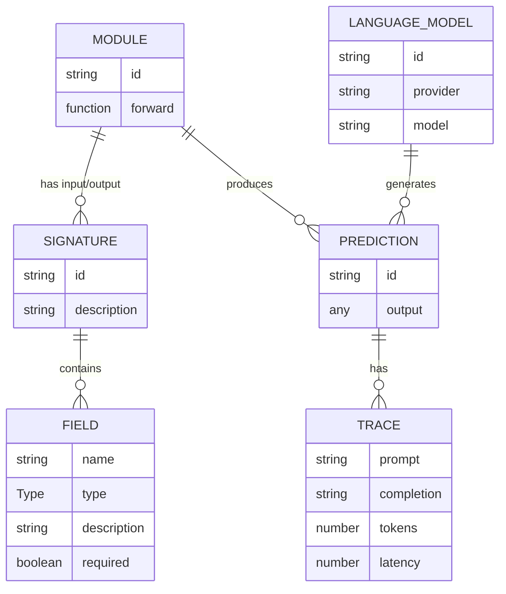

# Architecture Document: DSTyS - DSPy in TypeScript with Effect

## Document Information
- **Project Name**: DSTyS (DSPy in TypeScript with Effect)
- **Document Version**: 1.0
- **Last Updated**: 2025-05-20
- **Author(s)**: Codegen
- **Status**: Draft
- **Approvers**: [Project Stakeholders]

## 1. Introduction

### 1.1 Purpose
This architecture document defines the technical foundation and implementation approach for the DSTyS project. It outlines the technology stack, system architecture, API design, data model, and implementation strategies that will be used to build a TypeScript implementation of Stanford NLP's DSPy framework with Effect integration.

### 1.2 Scope
This document covers the architectural design for the core DSTyS library, including all components required to achieve 100% feature parity with the Python DSPy framework. It includes the technology stack selection, system architecture, API design, data model, non-functional requirements implementation, and test-driven development strategy.

### 1.3 Audience
This document is intended for:
- Technical leads and architects responsible for designing and implementing the DSTyS library
- Developers who will be building the library components
- Stakeholders who need to understand the technical approach
- Future contributors who need to understand the architectural decisions

### 1.4 References
- [DSTyS Product Requirements Document](./DSTyS_Product_Requirements_Document.md)
- [DSPy GitHub Repository](https://github.com/stanfordnlp/dspy)
- [DSPy Documentation](https://dspy.ai/)
- [Effect Documentation](https://effect.website/)
- [DSPy Paper: Compiling Declarative Language Model Calls into Self-Improving Pipelines](https://arxiv.org/abs/2310.03714)

## 2. Technology Stack Selection

### 2.1 Overview of Selected Technologies
DSTyS will be built using a modern TypeScript stack with a focus on functional programming principles through the Effect library. The technology choices prioritize type safety, maintainability, testability, and performance while ensuring compatibility with the Node.js ecosystem.

### 2.2 Core Technologies
| Technology | Version | Purpose | Justification |
|------------|---------|---------|---------------|
| TypeScript | 5.0+ | Primary programming language | Strong static typing, excellent tooling, widespread adoption in the JavaScript ecosystem |
| Effect | 2.0+ | Functional programming and error handling | Provides robust error handling, resource management, and functional programming patterns |
| Node.js | 20+ | Runtime environment | LTS version with modern JavaScript features, widespread adoption |
| ESM | - | Module system | Modern JavaScript module system with better tree-shaking and static analysis |
| Zod | 3.0+ | Runtime type validation | Ensures type safety at runtime, especially for external API interactions |
| fp-ts | 2.0+ | Functional programming utilities | Complements Effect with additional functional programming utilities |

### 2.3 Development Tools
| Tool | Version | Purpose | Justification |
|------|---------|---------|---------------|
| Vitest | 0.34+ | Testing framework | Fast, ESM-compatible testing with excellent TypeScript support |
| ESLint | 8.0+ | Code linting | Enforces code quality and consistency |
| Prettier | 3.0+ | Code formatting | Ensures consistent code style |
| TypeDoc | 0.24+ | Documentation generation | Generates API documentation from TypeScript code |
| SWC | 1.3+ | TypeScript compilation | Faster compilation compared to tsc |
| Biome | 1.0+ | Code quality tooling | Modern, fast, and comprehensive code quality tooling |

### 2.4 Infrastructure and Deployment
| Component | Technology | Purpose | Justification |
|-----------|------------|---------|---------------|
| Package Registry | npm | Distribution | Standard package registry for JavaScript/TypeScript libraries |
| CI/CD | GitHub Actions | Automated testing and deployment | Tight integration with GitHub, flexible workflow configuration |
| Versioning | Semantic Versioning | Version management | Industry standard for versioning libraries |
| Documentation | GitHub Pages | Hosting documentation | Free, integrated with GitHub, supports custom domains |

### 2.5 Alternatives Considered
- **Deno vs. Node.js**: Deno was considered for its built-in TypeScript support and security features, but Node.js was chosen for its wider adoption and ecosystem.
- **io-ts vs. Zod**: io-ts was considered for its integration with fp-ts, but Zod was chosen for its more intuitive API and better error messages.
- **Jest vs. Vitest**: Jest was considered for its popularity, but Vitest was chosen for its better ESM support and faster performance.
- **tsc vs. SWC**: tsc was considered for its official status, but SWC was chosen for its significantly faster compilation times.
- **React vs. No UI Framework**: Including React was considered for potential UI components, but was excluded to keep the core library focused and dependency-light.

## 3. System Architecture

### 3.1 Architecture Overview
DSTyS follows a modular architecture that closely mirrors the Python DSPy framework while leveraging TypeScript's type system and Effect's functional programming patterns. The system is composed of several core modules that can be composed to build complex AI pipelines.

### 3.2 Architecture Principles
1. **Type Safety**: Leverage TypeScript's type system to provide compile-time safety
2. **Functional Programming**: Use Effect for functional programming patterns and error handling
3. **Modularity**: Design components that can be composed and reused
4. **Testability**: Ensure all components are easily testable
5. **Feature Parity**: Maintain 100% feature parity with Python DSPy
6. **Developer Experience**: Prioritize clear APIs and helpful error messages

### 3.3 System Components
The DSTyS architecture consists of the following major components:

1. **Core Primitives**:
   - Signatures: Define input and output types for modules
   - Modules: Composable units of functionality
   - Predictors: Components that interact with foundation models

2. **Language Model Clients**:
   - Abstract interfaces for interacting with foundation models
   - Provider-specific implementations (OpenAI, Anthropic, etc.)
   - Caching and retry mechanisms

3. **Prediction Modules**:
   - Specialized modules for different prediction patterns
   - Chain of Thought, ReAct, Program of Thought, etc.

4. **Optimization (Teleprompt)**:
   - Components for optimizing prompts and pipelines
   - Bootstrapping, distillation, and other optimization techniques

5. **Retrieval**:
   - Components for retrieving relevant information
   - Vector stores, keyword search, hybrid approaches

6. **Evaluation**:
   - Metrics and evaluation frameworks
   - Benchmarking tools

7. **Effect Integration**:
   - Error handling patterns
   - Resource management
   - Asynchronous operations

### 3.4 Component Diagrams



**(Note: More detailed component interaction and data flow diagrams for key operations, such as a `Predict` call or a `BootstrapFewShot` compilation step, will be added here or in a linked document. These diagrams will illustrate how `Signature`, `Module`, `Predictor`, `LM`, and `Effect` interact in specific scenarios.)**

### 3.5 Deployment Architecture
As a library, DSTyS itself doesn't have a deployment architecture, but here's a typical deployment architecture for applications using DSTyS:



### 3.6 Integration Points
DSTyS will integrate with the following external systems:

1. **Foundation Model Providers**:
   - OpenAI API
   - Anthropic API
   - Other LLM providers

2. **Vector Databases**:
   - Pinecone
   - Weaviate
   - Milvus
   - Qdrant
   - Others

3. **Embedding Providers**:
   - OpenAI Embeddings
   - Cohere Embeddings
   - Others

4. **Local Model Inference**:
   - Ollama
   - LM Studio
   - Others

## 4. API Design

### 4.1 API Overview
The DSTyS API is designed to be intuitive for TypeScript developers while maintaining feature parity with Python DSPy. It leverages TypeScript's type system to provide compile-time safety and Effect for functional programming patterns and error handling.

### 4.2 Core API Components

#### 4.2.1 Signatures
Signatures define the input and output types for modules.

```typescript
// Example Signature Definition
const QuestionAnswerSignature = Signature({
  question: Field(String, "The question to answer"),
  answer: Field(String, "The answer to the question")
});
```

#### 4.2.2 Modules
Modules are the building blocks of DSTyS pipelines.

```typescript
// Example Module Definition
class QuestionAnswerer extends Module({
  input: QuestionSignature,
  output: AnswerSignature
}) {
  constructor(private lm: LanguageModel) {
    super();
  }

  forward = (input: Input<typeof QuestionSignature>) => {
    return this.lm.predict(
      QuestionAnswerSignature,
      { question: input.question }
    );
  };
}
```

#### 4.2.3 Predictors
Predictors are specialized modules that implement different prediction patterns.

```typescript
// Example Chain of Thought Predictor
const answerer = new ChainOfThought({
  signature: QuestionAnswerSignature,
  lm: new OpenAI({ model: "gpt-4" })
});
```

### 4.3 Leveraging Effect's Type System

DSTyS leverages Effect's powerful type system to provide compile-time safety for errors, dependencies, and success values. The Effect type has three type parameters:

```typescript
// General form of an Effect
//    ┌─── Represents the success type
//    │ ┌─── Represents the error type
//    │ │ ┌─── Represents required dependencies
//    ↓ ↓ ↓
Effect<Success, Error, Requirements>
```

#### 4.3.1 Type-Safe Error Handling

Unlike traditional TypeScript where errors are not tracked in the type system, Effect makes errors part of the type signature:

```typescript
// Traditional TypeScript - errors are not tracked in the type system
const divide = (a: number, b: number): number => {
  if (b === 0) {
    throw new Error("Cannot divide by zero");
  }
  return a / b;
};

// Effect approach - errors are tracked in the type system
class DivisionError {
  readonly _tag = "DivisionError";
  constructor(readonly message: string) {}
}

const divide = (a: number, b: number): Effect.Effect<number, DivisionError, never> =>
  b === 0
    ? Effect.fail(new DivisionError("Cannot divide by zero"))
    : Effect.succeed(a / b);
```

This allows for compile-time checking of error handling:

```typescript
// The type signature tells us exactly what can go wrong
const calculateAverage = (values: number[]): Effect.Effect<number, DivisionError, never> =>
  Effect.gen(function* () {
    const sum = values.reduce((acc, val) => acc + val, 0);
    // TypeScript knows this might fail with DivisionError
    const average = yield* divide(sum, values.length);
    return average;
  });

// We must handle the error or propagate it
const safeCalculateAverage = (values: number[]): Effect.Effect<number, never, never> =>
  calculateAverage(values).pipe(
    Effect.catchTag("DivisionError", (error) =>
      Effect.succeed(0) // Provide a default value in case of error
    )
  );
```

#### 4.3.2 Tagged Errors for Pattern Matching

Effect uses tagged errors to enable precise error handling through pattern matching:

```typescript
// Define different error types with unique tags
class NetworkError {
  readonly _tag = "NetworkError";
  constructor(readonly message: string) {}
}

class ValidationError {
  readonly _tag = "ValidationError";
  constructor(readonly field: string, readonly message: string) {}
}

class AuthError {
  readonly _tag = "AuthError";
  constructor(readonly reason: string) {}
}

// Function that can fail with different error types
const fetchUserData = (userId: string): Effect.Effect<UserData, NetworkError | ValidationError | AuthError, never> => {
  // Implementation...
};

// Handle specific error types
const result = await fetchUserData("user123").pipe(
  Effect.catchTag("NetworkError", (error) =>
    Effect.retry(fetchUserData("user123"), {
      schedule: Schedule.exponential(100, 2),
      times: 3
    })
  ),
  Effect.catchTag("ValidationError", (error) =>
    Effect.succeed({ name: "Unknown", id: "user123" }) // Default data
  ),
  Effect.catchTag("AuthError", (error) =>
    Effect.fail(new Error(`Authentication failed: ${error.reason}`))
  ),
  Effect.runPromise
);
```

#### 4.3.3 Dependency Injection with Context.Tag

Effect provides a powerful dependency injection system using `Context.Tag`:

```typescript
import { Effect, Context } from "effect";

// Define a service interface
interface LoggerService {
  log: (message: string) => Effect.Effect<void, never, never>;
  error: (message: string, error?: unknown) => Effect.Effect<void, never, never>;
}

// Create a service tag
class Logger extends Context.Tag("LoggerService")<Logger, LoggerService>() {}

// Implement the service
const ConsoleLoggerLive: Effect.Layer<Logger, never, never> = Effect.layer({
  build: () => ({
    log: (message) => Effect.sync(() => console.log(message)),
    error: (message, error) => Effect.sync(() => console.error(message, error))
  })
});

// Use the service in your application code
const program = Effect.gen(function* () {
  // Access the logger service
  const logger = yield* Logger;
  
  yield* logger.log("Starting application...");
  
  try {
    // Application logic
    yield* logger.log("Application running");
  } catch (error) {
    yield* logger.error("Application error", error);
  }
});

// Provide the implementation at the edge of your application
const runnable = program.pipe(
  Effect.provide(ConsoleLoggerLive)
);

Effect.runPromise(runnable);
```

#### 4.3.4 Composing Services with Dependencies

Services can depend on other services, creating a dependency graph that Effect manages automatically:

```typescript
// Database service
interface DatabaseService {
  query: (sql: string) => Effect.Effect<QueryResult, DatabaseError, never>;
}

class Database extends Context.Tag("DatabaseService")<Database, DatabaseService>() {}

// User repository service that depends on Database
interface UserRepositoryService {
  findById: (id: string) => Effect.Effect<User, DatabaseError | NotFoundError, never>;
}

class UserRepository extends Context.Tag("UserRepositoryService")<UserRepository, UserRepositoryService>() {}

// Implementation of UserRepository that depends on Database
const UserRepositoryLive: Effect.Layer<UserRepository, never, Database> = Effect.layer({
  build: (context) => {
    // Get the database service from the context
    const db = context.get(Database);
    
    return {
      findById: (id) => Effect.gen(function* () {
        const result = yield* db.query(`SELECT * FROM users WHERE id = '${id}'`);
        
        if (result.rows.length === 0) {
          return yield* Effect.fail(new NotFoundError(`User with id ${id} not found`));
        }
        
        return result.rows[0] as User;
      })
    };
  }
});

// Application code that uses UserRepository
const getUserDetails = (userId: string): Effect.Effect<UserDetails, DatabaseError | NotFoundError, UserRepository> =>
  Effect.gen(function* () {
    const userRepo = yield* UserRepository;
    const user = yield* userRepo.findById(userId);
    return {
      id: user.id,
      name: user.name,
      email: user.email
    };
  });

// Provide all dependencies at the edge of your application
const runnable = getUserDetails("user123").pipe(
  Effect.provide(UserRepositoryLive),
  Effect.provide(DatabaseLive)
);

Effect.runPromise(runnable);
```

#### 4.3.5 Specific Effect TS Patterns per Architectural Layer
While Effect TS provides a rich set of tools, their application will be tailored to the needs of different architectural layers within DSTyS:

-   **Core Primitives (Signatures, Modules, Predictors)**:
    -   `Effect.succeed` and `Effect.fail` for basic success/failure paths.
    -   `Effect.map`, `Effect.flatMap` (`Effect.gen`) for composing operations.
    -   Tagged unions for representing specific error states (e.g., `SignatureValidationError`, `ModuleExecutionError`).
    -   `Effect.Schema` for robust parsing and validation of inputs and outputs, especially when dealing with dynamic structures or external data.

-   **Language Model Clients (LM Clients)**:
    -   `Effect.tryPromise` for wrapping API calls to external LM services.
    -   `Effect.retry` with `Schedule` for implementing robust retry logic (e.g., exponential backoff for API rate limits).
    -   `Effect.Layer` for managing dependencies like HTTP clients or API key providers.
    -   `Effect.Scope` for managing resources like network connections.
    -   `Effect.Cache` for caching LM responses.
    -   `Effect.Stream` for handling streaming responses from LMs.

-   **Prediction Modules (ChainOfThought, ReAct, etc.)**:
    -   `Effect.gen` (generator-based do-notation) for sequencing complex reasoning steps.
    -   `Effect.all` (for parallelism) or `Effect.forEach(..., { concurrency: "inherit" | number })` for concurrent tool calls or parallel sub-module executions.
    -   Custom tagged error types to represent failures specific to a prediction strategy (e.g., `ToolExecutionError` in ReAct).
    -   State management using immutable updates passed through `Effect` computations, or via `Ref` for localized mutable state if absolutely necessary and carefully managed.

-   **Optimization (Teleprompt)**:
    -   `Effect.Layer` for injecting dependencies like metrics, datasets, or teacher models.
    -   `Effect.forEach(..., { concurrency: "inherit" | number })` for parallel evaluation of candidate programs.
    -   `Effect.Scope` for managing resources during long-running optimization processes.
    -   `Effect.tap` for logging and tracing intermediate states during optimization.
    -   Error handling to gracefully manage failures in individual optimization trials without halting the entire process.

-   **Retrieval**:
    -   `Effect.tryPromise` for interacting with vector databases or search APIs.
    -   `Effect.Layer` for managing database connections or search client instances.
    -   `Effect.Cache` for caching retrieval results.

This layer-specific application of Effect TS patterns aims to maximize the benefits of the library while keeping the complexity appropriate for each component's responsibilities. An Architectural Decision Record (ADR) will further detail these patterns and their rationale.

### 4.4 API Documentation
The API will be documented using TypeDoc with the following components:
- Comprehensive type definitions
- Usage examples
- API reference
- Tutorials and guides

### 4.5 Architectural Strategy for Python's Dynamic Features
Python DSPy leverages dynamic features (e.g., metaclasses for `Signature`, dynamic attribute assignment for `Predictor.demos`, runtime modification of signatures by modules like `ChainOfThought`) that do not have direct equivalents in TypeScript or are not idiomatic with Effect TS. DSTyS will address these through the following strategies, to be detailed in an **Architectural Decision Record (ADR) on "Translating Pythonic Dynamism"**:

-   **Signatures**:
    -   Instead of metaclasses, DSTyS Signatures will likely use a combination of:
        -   **Builder Patterns**: Fluent APIs for constructing and modifying signatures in a type-safe manner.
        -   **Advanced Generics and Conditional Types**: To infer and enforce relationships between input/output fields at compile time.
        -   **Immutable Transformations**: Functions that take a signature and return a new, modified signature, preserving immutability.
    -   Runtime validation of signature structures will be handled by Zod, integrated via `Effect.Schema`.

-   **Predictor State (e.g., `demos`)**:
    -   Dynamic attribute assignment will be replaced with explicit state management mechanisms:
        -   **Immutable Updates**: Methods that return new `Predictor` instances with updated state (e.g., new demos).
        -   **Context Passing**: For state that varies per call, relevant context can be passed explicitly.
        -   **Effect `Ref` or `FiberRef`**: For localized, managed mutable state if strictly necessary, ensuring functional purity at the boundaries. `Effect.Layer` can provide stateful services.

-   **Module-driven Signature Modification (e.g., `ChainOfThought` adding `rationale`)**:
    -   Runtime modification of signatures will be handled through:
        -   **Explicit Composition**: Modules like `ChainOfThought` will clearly define their output signature, including added fields like `rationale`. The composition of such modules will result in a new, well-defined signature.
        -   **Type-level Transformations**: TypeScript's mapped types or conditional types might be explored to represent how a module transforms an input signature into an output signature at the type level, enhancing static guarantees.

The ADR will provide concrete code patterns and justifications for these approaches, prioritizing type safety, functional purity, and developer experience within the TypeScript/Effect TS paradigm.

### 4.6 API Versioning Strategy
DSTyS will follow semantic versioning:
- **Major versions**: Breaking changes
- **Minor versions**: New features, non-breaking changes
- **Patch versions**: Bug fixes, non-breaking changes

### 4.7 Serialization/Deserialization Strategy
The ability to save and load `Module` states (including `Predictor` configurations like demos, LM settings, and compiled optimizer states) is crucial for reproducibility and sharing trained programs. DSTyS will implement this with the following considerations:

-   **Data Format**: JSON will be the primary serialization format for its ubiquity and human-readability.
-   **Schema Definition and Validation**:
    -   Zod schemas will be defined for all serializable components (`Module`, `Predictor`, `Signature`, `Example`, `LM` configurations, etc.).
    -   These schemas will be used for validation during deserialization to ensure data integrity and catch versioning issues. `Effect.Schema` can be used to integrate Zod schemas into Effect-based workflows.
-   **Custom Serializers/Deserializers**:
    -   For complex objects or Effect-specific constructs (if any are directly serialized, though this should be minimized), custom serialization logic might be needed.
    -   Pydantic-like models in TypeScript (potentially using classes with Zod schemas or dedicated libraries) will define `toJSON()` and `fromJSON()` (or equivalent static factory) methods.
-   **Handling Effect-wrapped State**:
    -   Generally, Effect computations themselves are not serialized. Instead, the *configuration* or *data* that defines these computations will be serialized.
    -   For example, if an optimizer's state involves Effect `Ref`s or `Fiber`s, the underlying data in those `Ref`s would be extracted and serialized, not the Effect constructs themselves. Upon deserialization, new Effect constructs would be initialized with the loaded data.
-   **Versioning**: Serialized formats will include a version number to handle schema evolution and provide migration paths or clear error messages for incompatible versions.
-   **Extensibility**: The serialization mechanism should be extensible to allow users to define how custom `Module` subclasses are serialized and deserialized.

A dedicated `save(path: string)` and static `load(path: string): Effect<Module, Error>` method will be provided on the `Module` base class.

## 5. Data Model

### 5.1 Data Model Overview
The DSTyS data model is designed to represent the core concepts of the DSPy framework in TypeScript. It leverages TypeScript's type system to provide compile-time safety and validation.

### 5.2 Core Data Entities

#### 5.2.1 Signature
Represents the input and output types for modules.

```typescript
interface SignatureDefinition {
  fields: Record<string, FieldDefinition>;
  description?: string;
}

interface FieldDefinition {
  type: Type<any>;
  description: string;
  required: boolean;
  default?: any;
}
```

#### 5.2.2 Module
Represents a composable unit of functionality.

```typescript
interface ModuleDefinition {
  input: SignatureDefinition;
  output: SignatureDefinition;
}

interface Module<I, O> {
  forward: (input: I) => Effect<O, Error, never>;
}
```

#### 5.2.3 Prediction
Represents the result of a prediction.

```typescript
interface Prediction<T> {
  output: T;
  trace?: PredictionTrace;
}

interface PredictionTrace {
  prompt: string;
  completion: string;
  tokens: number;
  latency: number;
}
```

#### 5.2.4 Language Model
Represents a foundation model.

```typescript
interface LanguageModel {
  predict: <T>(signature: SignatureDefinition, input: Record<string, any>) => Effect<Prediction<T>, Error, never>;
}
```

### 5.3 Entity Relationship Diagram



### 5.4 Data Storage
As a library, DSTyS itself doesn't store data persistently, but it provides interfaces for caching predictions:

```typescript
interface Cache {
  get: (key: string) => Effect<Prediction<any> | null, Error, never>;
  set: (key: string, value: Prediction<any>) => Effect<void, Error, never>;
}
```

Implementations will be provided for:
- In-memory cache
- File-based cache
- Redis cache
- Others as needed

## 6. Non-Functional Requirements Implementation

### 6.1 Performance

#### 6.1.1 Performance Metrics
| Metric | Target | Measurement Method |
|--------|--------|-------------------|
| Library Overhead | <10ms per operation | Benchmarking suite comparing direct API calls vs. DSTyS |
| Memory Usage | <50MB baseline | Memory profiling during benchmark tests |
| Bundle Size | <500KB (core), <2MB (full) | Measurement during build process |
| API Latency | No additional latency over direct calls | Comparative benchmarking |

#### 6.1.2 Performance Optimization Strategies
- **Efficient Type Checking**: Use runtime type checking only when necessary
- **Caching**: Implement multi-level caching for predictions
- **Lazy Loading**: Load components only when needed
- **Tree Shaking**: Ensure unused code is not included in bundles
- **Streaming**: Support streaming responses from foundation models

### 6.2 Security

#### 6.2.1 Authentication and Authorization
- Support for secure API key management
- Integration with environment variables and secret managers
- No hardcoded credentials in code or logs

#### 6.2.2 Data Protection
- No persistent storage of sensitive data
- Optional encryption for cached data
- Sanitization of logs to remove sensitive information

#### 6.2.3 Security Controls
- Input validation for all external inputs
- Rate limiting support to prevent abuse
- Secure defaults for all configurations

#### 6.2.4 Security Testing
- Static analysis for security vulnerabilities
- Dependency scanning for known vulnerabilities
- Regular security reviews

### 6.3 Scalability

#### 6.3.1 Scalability Requirements
- Support for handling multiple concurrent requests
- Efficient resource utilization under load
- Graceful degradation under high load

#### 6.3.2 Scaling Strategies
- **Parallel Processing**: Support for processing multiple requests in parallel
- **Connection Pooling**: Efficient management of connections to external services
- **Backpressure Handling**: Mechanisms to handle backpressure when external services are overloaded

### 6.4 Availability and Reliability

#### 6.4.1 Availability Requirements
- Library should be available for use 24/7
- No single points of failure in the library design

#### 6.4.2 Fault Tolerance
- Comprehensive error handling for all external service interactions
- Retry mechanisms with exponential backoff
- Circuit breakers for failing external services
- Fallback mechanisms when primary services are unavailable

#### 6.4.3 Monitoring and Alerting
- Instrumentation for key metrics
- Integration with common monitoring tools
- Detailed error reporting

### 6.5 Maintainability

#### 6.5.1 Code Quality
- Comprehensive test coverage (>80%)
- Strict linting rules
- Consistent code style
- Clear separation of concerns

#### 6.5.2 Documentation
- Comprehensive API documentation
- Usage examples
- Architecture documentation
- Contribution guidelines

#### 6.5.3 Deployment and Operations
- Automated release process
- Semantic versioning
- Comprehensive changelogs
- Migration guides for breaking changes

## 7. Test-Driven Development Strategy

### 7.1 Testing Approach
DSTyS will follow a test-driven development approach, with tests written before implementation to ensure that the library meets its requirements and maintains feature parity with Python DSPy.

### 7.2 Test Levels

#### 7.2.1 Unit Testing
- Test individual components in isolation
- Mock external dependencies
- Focus on behavior, not implementation details
- Use property-based testing for complex logic

```typescript
// Example Unit Test
test("Signature validates input correctly", () => {
  const signature = Signature({
    name: Field(String, "Person's name"),
    age: Field(Number, "Person's age")
  });
  
  // Valid input
  expect(signature.validate({ name: "John", age: 30 })).toEqual({ name: "John", age: 30 });
  
  // Invalid input
  expect(() => signature.validate({ name: "John", age: "30" })).toThrow();
});
```

#### 7.2.2 Integration Testing
- Test interactions between components
- Test integration with external services using mocks
- Focus on component interfaces

```typescript
// Example Integration Test
test("Module uses language model correctly", async () => {
  const mockLM = {
    predict: vi.fn().mockResolvedValue({ output: { answer: "Paris" } })
  };
  
  const module = new QuestionAnswerer(mockLM);
  const result = await module.forward({ question: "What is the capital of France?" });
  
  expect(result).toEqual({ answer: "Paris" });
  expect(mockLM.predict).toHaveBeenCalledWith(
    expect.anything(),
    { question: "What is the capital of France?" }
  );
});
```

#### 7.2.3 System Testing
- Test complete pipelines
- Test with real external services in controlled environments
- Focus on end-to-end behavior

```typescript
// Example System Test
test("Complete pipeline works end-to-end", async () => {
  // Set up a complete pipeline
  const lm = new OpenAI({ model: "gpt-3.5-turbo" });
  const retriever = new VectorRetriever(/* ... */);
  const answerer = new RAG({ lm, retriever });
  
  // Test with a real question
  const result = await answerer.forward({ question: "What is TypeScript?" });
  
  // Verify the result meets expectations
  expect(result.answer).toContain("programming language");
});
```

#### 7.2.4 Performance Testing
- Benchmark key operations
- Compare performance with direct API calls
- Identify and address bottlenecks

```typescript
// Example Performance Test
benchmark("Prediction performance", async () => {
  const lm = new OpenAI({ model: "gpt-3.5-turbo" });
  const module = new QuestionAnswerer(lm);
  
  // Warm-up
  await module.forward({ question: "Warm-up question?" });
  
  // Benchmark
  const start = performance.now();
  for (let i = 0; i < 10; i++) {
    await module.forward({ question: `Question ${i}?` });
  }
  const end = performance.now();
  
  expect(end - start).toBeLessThan(10000); // Less than 1s per question on average
});
```

### 7.3 Test Environments
- **Local**: Developer machines for rapid iteration
- **CI**: Automated tests on pull requests
- **Staging**: Tests with real external services before release
- **Production**: Smoke tests after deployment

### 7.4 Test Data Management
- Use fixture data for repeatable tests
- Generate synthetic data for edge cases
- Use anonymized real data for realistic scenarios
- Version control test data alongside code

### 7.5 Continuous Integration and Delivery
- Run tests on every pull request
- Block merges if tests fail
- Run comprehensive test suite before releases
- Automate release process

## 8. Implementation Plan

### 8.1 Implementation Phases

#### Phase 1: Core Foundation (Weeks 1-4)
- Set up project structure and build system
- Implement core primitives (Signatures, Modules, Predictors)
- Implement basic language model clients
- Establish test framework and CI/CD pipeline

#### Phase 2: Basic Functionality (Weeks 5-8)
- Implement basic prediction modules
- Implement caching and retry mechanisms
- Implement basic retrieval components
- Develop initial documentation

#### Phase 3: Advanced Features (Weeks 9-12)
- Implement advanced prediction modules
- Implement optimization components
- Implement advanced retrieval components
- Enhance documentation with examples

#### Phase 4: Refinement and Release (Weeks 13-16)
- Performance optimization
- Comprehensive testing
- Complete documentation
- Prepare for initial release

### 8.2 Dependencies
- Access to foundation model APIs (OpenAI, Anthropic, etc.)
- Access to vector database services for testing
- Python DSPy codebase for reference
- Effect library documentation and support

### 8.3 Risks and Mitigations

| Risk | Impact | Likelihood | Mitigation |
|------|--------|------------|------------|
| API changes in foundation models | High | Medium | Design flexible interfaces, monitor for changes, implement adapters |
| Performance issues | Medium | Medium | Early performance testing, optimization strategies, caching |
| Complexity of porting Python patterns | High | High | Start with core functionality, incremental approach, thorough testing |
| Dependency on external services | Medium | High | Mock external services for testing, implement fallbacks |
| Breaking changes in Effect | Medium | Low | Pin dependency versions, monitor for changes, adapt gradually |

### 8.4 Resource Requirements
- 2-3 TypeScript developers with functional programming experience
- 1 AI/ML specialist familiar with foundation models
- Access to foundation model APIs (budget for API usage)
- Development and testing environments

## 9. Appendices

### 9.1 Glossary
- **DSPy**: Declarative Self-improving Python, a framework for programming foundation models
- **Effect**: A TypeScript library for functional programming with robust error handling
- **Foundation Model**: Large language models like GPT-4, Claude, etc. that serve as the base for AI applications
- **RAG**: Retrieval-Augmented Generation, a technique for enhancing LLM outputs with retrieved information
- **TDD**: Test-Driven Development, a software development process relying on a short development cycle
- **LLM**: Large Language Model, a type of AI model trained on vast amounts of text data

### 9.2 References
- [DSPy GitHub Repository](https://github.com/stanfordnlp/dspy)
- [DSPy Documentation](https://dspy.ai/)
- [Effect Documentation](https://effect.website/)
- [DSPy Paper: Compiling Declarative Language Model Calls into Self-Improving Pipelines](https://arxiv.org/abs/2310.03714)
- [TypeScript Documentation](https://www.typescriptlang.org/docs/)
- [OpenAI API Documentation](https://platform.openai.com/docs/api-reference)
- [Anthropic API Documentation](https://docs.anthropic.com/claude/reference)

### 9.3 Revision History
| Version | Date | Author | Description of Changes |
|---------|------|--------|------------------------|
| 1.0 | 2025-05-20 | Codegen | Initial version |

---

## Notes on Using This Example

This Architecture Document example demonstrates how to apply the template to a real project. It provides:
- Detailed technology stack selection with justifications
- Comprehensive system architecture with component diagrams
- API design with code examples
- Data model with entity relationships
- Implementation strategies for non-functional requirements
- Test-driven development approach with example tests
- Phased implementation plan with risks and mitigations

When creating your own Architecture Document, be sure to:
- Tailor the content to your specific project needs
- Include detailed diagrams to illustrate system components and interactions
- Provide code examples where appropriate
- Justify technology choices based on project requirements
- Address all non-functional requirements
- Outline a comprehensive testing strategy
- Create a realistic implementation plan with phases and milestones