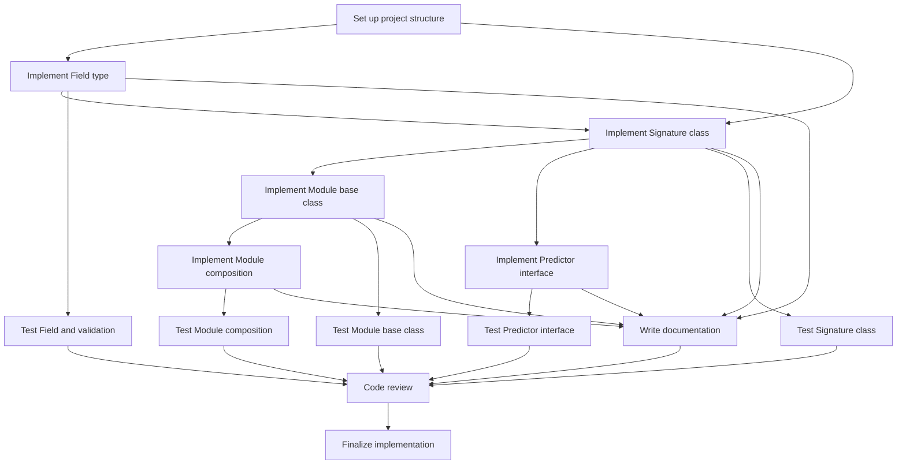
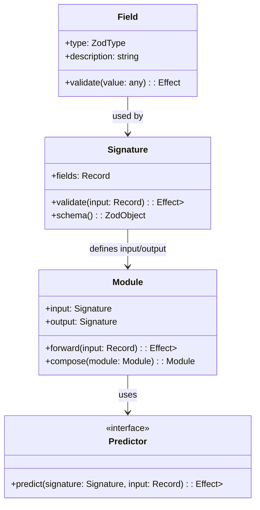

# Workplan: Implement Core Primitives for DSTyS

## Document Information
- **Workplan ID**: WP-001
- **Project**: DSTyS (DSPy in TypeScript with Effect)
- **Document Version**: 1.0
- **Last Updated**: 2025-05-20
- **Author(s)**: Codegen
- **Status**: Draft
- **Approvers**: [Technical Lead, AI Specialist]

## 1. Objective

### 1.1 Purpose
This workplan aims to implement the core primitives of the DSTyS library, including Signatures, Modules, and Predictors. These primitives form the foundation of the entire library and enable the composition of AI pipelines using foundation models.

### 1.2 Scope
This workplan covers the implementation of:
- Signature class and related utilities
- Module base class and core functionality
- Predictor interface and basic implementation
- Field type definitions and validation
- Integration with Effect for error handling and functional programming patterns

This workplan does not include:
- Language model client implementations (covered in a separate workplan)
- Advanced prediction modules (covered in separate workplans)
- Optimization components (covered in separate workplans)
- Retrieval components (covered in separate workplans)

### 1.3 Expected Outcomes
- A fully implemented and tested Signature class that supports type definitions and validation
- A fully implemented and tested Module base class that can be extended for specific use cases
- A fully implemented and tested Predictor interface that defines how modules interact with foundation models
- Integration with Effect for robust error handling and functional programming patterns
- Comprehensive unit tests for all implemented components
- Documentation for all public APIs

## 2. Prerequisites

### 2.1 Dependencies
| Dependency | Type | Status | Notes |
|------------|------|--------|-------|
| Project Setup | Technical | Complete | Basic project structure, build system, and CI/CD pipeline must be set up |
| TypeScript Configuration | Technical | Complete | TypeScript must be configured with appropriate settings for the project |
| Effect Library | Technical | Complete | Effect library must be installed and available |
| Zod Library | Technical | Complete | Zod library must be installed for runtime type validation |
| Architecture Decision Record (ADR) | Technical | Complete | ADR for Effect integration patterns must be approved |

### 2.2 Required Resources
| Resource | Type | Availability | Notes |
|----------|------|--------------|-------|
| TypeScript Developer | Personnel | Available | Developer with strong TypeScript and functional programming experience |
| AI Specialist | Personnel | Available | Specialist familiar with DSPy and foundation models |
| Development Environment | Environment | Available | Node.js 20+, TypeScript 5.0+, and required dependencies |
| Python DSPy Codebase | Tool | Available | Access to Python DSPy codebase for reference |
| Unit Testing Framework | Tool | Available | Vitest or similar testing framework |

### 2.3 Knowledge Requirements
- Strong understanding of TypeScript's type system, including generics and conditional types
- Familiarity with functional programming concepts and patterns
- Understanding of the Effect library and its core concepts
- Knowledge of the Python DSPy framework and its core primitives
- Experience with test-driven development practices

## 3. Detailed Tasks

### 3.1 Task Breakdown
| Task ID | Task Description | Estimated Effort | Dependencies | Assignee |
|---------|------------------|------------------|--------------|----------|
| T1 | Set up project structure for core primitives | 4 hours | Project Setup | TypeScript Developer |
| T2 | Implement Field type and validation | 8 hours | T1 | TypeScript Developer |
| T3 | Implement Signature class with Effect integration | 16 hours | T1, T2 | TypeScript Developer |
| T4 | Implement Module base class | 16 hours | T3 | TypeScript Developer |
| T5 | Implement Predictor interface | 8 hours | T3 | TypeScript Developer |
| T6 | Implement basic Module composition | 12 hours | T4 | TypeScript Developer |
| T7 | Write unit tests for Field and validation | 8 hours | T2 | TypeScript Developer |
| T8 | Write unit tests for Signature class | 12 hours | T3 | TypeScript Developer |
| T9 | Write unit tests for Module base class | 12 hours | T4 | TypeScript Developer |
| T10 | Write unit tests for Predictor interface | 8 hours | T5 | TypeScript Developer |
| T11 | Write unit tests for Module composition | 12 hours | T6 | TypeScript Developer |
| T12 | Write documentation for all implemented components | 16 hours | T2, T3, T4, T5, T6 | TypeScript Developer |
| T13 | Perform code review and address feedback | 8 hours | T7, T8, T9, T10, T11, T12 | TypeScript Developer, AI Specialist |
| T14 | Finalize implementation and prepare for integration | 4 hours | T13 | TypeScript Developer |

### 3.2 Task Sequence


### 3.3 Milestones
| Milestone | Description | Target Date | Tasks Completed |
|-----------|-------------|-------------|-----------------|
| M1 | Project structure and Field implementation | Day 2 | T1, T2 |
| M2 | Signature and basic classes implemented | Day 5 | T3, T4, T5 |
| M3 | Module composition implemented | Day 7 | T6 |
| M4 | All unit tests completed | Day 12 | T7, T8, T9, T10, T11 |
| M5 | Documentation completed | Day 14 | T12 |
| M6 | Implementation finalized | Day 16 | T13, T14 |

## 4. Technical Specifications

### 4.1 Architecture Context
The core primitives form the foundation of the DSTyS library, as described in the Architecture Document section 3.3:

> 1. **Core Primitives**:
>    - Signatures: Define input and output types for modules
>    - Modules: Composable units of functionality
>    - Predictors: Components that interact with foundation models

These components enable the composition of AI pipelines and provide the structure for all higher-level functionality in the library.

### 4.2 Design Details

#### 4.2.1 Component Design


#### 4.2.2 Data Models
```typescript
// Field type definition
interface FieldOptions {
  description: string;
  required?: boolean;
  default?: any;
}

// Signature definition
type SignatureDefinition = Record<string, Field>;

// Module configuration
interface ModuleConfig {
  input: Signature;
  output: Signature;
  predictor?: Predictor;
}

// Predictor options
interface PredictorOptions {
  maxRetries?: number;
  timeout?: number;
  cache?: boolean;
}

// Error types
type ValidationError = {
  readonly _tag: 'ValidationError';
  readonly path: string[];
  readonly message: string;
};

type ModuleError =
  | ValidationError
  | { readonly _tag: 'ForwardError'; readonly cause: unknown }
  | { readonly _tag: 'CompositionError'; readonly message: string };

type PredictorError =
  | { readonly _tag: 'PredictionFailed'; readonly cause: unknown }
  | { readonly _tag: 'Timeout'; readonly milliseconds: number }
  | { readonly _tag: 'RetryLimitExceeded'; readonly attempts: number };
```

#### 4.2.3 API Specifications
```typescript
// Field API
function Field(type: ZodType, description: string, options?: FieldOptions): Field;

// Signature API
function Signature(definition: SignatureDefinition): Signature;

// Module API
function Module(config: ModuleConfig): new (...args: any[]) => Module;

// Module instance methods
interface Module {
  forward(input: Record<string, any>): Effect<never, ModuleError, Record<string, any>>;
  compose<T extends Module>(module: T): ComposedModule<this, T>;
}

// Predictor API
interface Predictor {
  predict(
    signature: Signature,
    input: Record<string, any>
  ): Effect<never, PredictorError, Record<string, any>>;
}
```

### 4.3 Technical Constraints
- Must maintain 100% feature parity with Python DSPy's core primitives
- Must leverage TypeScript's type system for compile-time safety
- Must integrate with Effect for error handling and functional programming patterns
- Must support runtime type validation using Zod
- Must be compatible with Node.js 20+ and TypeScript 5.0+
- Must support both ESM and CommonJS module systems
- Must have minimal dependencies to reduce package size and potential vulnerabilities

### 4.4 Dependencies on Other Components
| Component | Interaction Type | Interface | Notes |
|-----------|------------------|-----------|-------|
| Effect | Uses | Effect's core APIs | Used for error handling, resource management, and functional programming patterns |
| Zod | Uses | Zod's type validation | Used for runtime type validation |
| Language Model Clients | Extended by | Predictor interface | Language model clients will implement the Predictor interface |
| Prediction Modules | Extends | Module base class | Prediction modules will extend the Module base class |

## 5. Testing Strategy

### 5.1 Testing Approach
The testing approach for the core primitives will follow test-driven development (TDD) principles:
1. Write tests before implementing functionality
2. Implement the minimum code required to pass the tests
3. Refactor the code while ensuring tests continue to pass

Tests will be written using Vitest and will include:
- Unit tests for individual components
- Integration tests for component interactions
- Property-based tests for complex logic
- Edge case tests for error handling

### 5.2 Test Cases
| Test ID | Test Description | Test Type | Test Data | Expected Result |
|---------|------------------|-----------|-----------|-----------------|
| TC1 | Field validates correct data types | Unit | Various data types | Validation passes for correct types, fails for incorrect types |
| TC2 | Field handles optional and default values | Unit | Missing values, null, undefined | Default values applied when appropriate |
| TC3 | Signature validates complete input object | Unit | Valid and invalid objects | Validation passes for valid objects, fails for invalid objects |
| TC4 | Signature converts to Zod schema correctly | Unit | Signature definition | Zod schema matches Signature definition |
| TC5 | Module forwards input to output correctly | Unit | Valid input object | Input processed and output returned |
| TC6 | Module validates input before processing | Unit | Invalid input object | ValidationError returned |
| TC7 | Module validates output after processing | Unit | Input that produces invalid output | ValidationError returned |
| TC8 | Module composition works correctly | Integration | Two compatible modules | Composed module processes input through both modules |
| TC9 | Module composition fails for incompatible modules | Integration | Two incompatible modules | CompositionError returned |
| TC10 | Predictor processes input correctly | Unit | Valid input for prediction | Prediction result returned |
| TC11 | Predictor handles errors gracefully | Unit | Input that causes prediction error | PredictorError returned |
| TC12 | End-to-end flow through multiple components | Integration | Complex pipeline setup | Pipeline processes input correctly |

### 5.3 Test Environment
- Local development environment with Node.js 20+ and TypeScript 5.0+
- CI environment with automated test runs on pull requests
- Test coverage reporting to ensure comprehensive test coverage

### 5.4 Test Data
- Fixture data for common test cases
- Generated test data for edge cases
- Mock implementations of foundation models for testing Predictor interface

### 5.5 Performance Testing
- Benchmark core operations to establish performance baselines
- Compare performance with direct API calls to ensure minimal overhead
- Test memory usage to identify potential memory leaks

## 6. Implementation Guidance

### 6.1 Best Practices
- Follow functional programming principles when implementing core primitives
- Use Effect for all operations that can fail or have side effects
- Leverage TypeScript's type system to provide compile-time safety
- Use Zod for runtime type validation
- Write comprehensive error messages to help developers debug issues
- Keep the API surface as close to Python DSPy as possible while leveraging TypeScript features
- Document all public APIs with JSDoc comments
- Follow the Effect library's conventions for error handling and resource management

### 6.2 Code Examples
```typescript
// Example Field implementation
import { Effect } from 'effect';
import { z } from 'zod';

export interface Field<T> {
  type: z.ZodType<T>;
  description: string;
  required: boolean;
  default?: T;
  validate(value: unknown): Effect.Effect<never, ValidationError, T>;
}

export function Field<T>(
  type: z.ZodType<T>,
  description: string,
  options: { required?: boolean; default?: T } = {}
): Field<T> {
  const required = options.required ?? true;
  
  return {
    type,
    description,
    required,
    default: options.default,
    validate: (value: unknown) => {
      if (value === undefined) {
        if (!required && options.default !== undefined) {
          return Effect.succeed(options.default);
        }
        if (!required) {
          return Effect.succeed(undefined as any);
        }
        return Effect.fail({
          _tag: 'ValidationError',
          path: [],
          message: `Required field is missing: ${description}`,
        });
      }
      
      const result = type.safeParse(value);
      if (result.success) {
        return Effect.succeed(result.data);
      }
      
      return Effect.fail({
        _tag: 'ValidationError',
        path: [],
        message: `Invalid value for field: ${description}. ${result.error.message}`,
      });
    },
  };
}

// Example Signature implementation
export interface Signature<T extends Record<string, any>> {
  fields: { [K in keyof T]: Field<T[K]> };
  validate(input: unknown): Effect.Effect<never, ValidationError, T>;
  schema(): z.ZodObject<{ [K in keyof T]: z.ZodType<T[K]> }>;
}

export function Signature<T extends Record<string, any>>(
  fields: { [K in keyof T]: Field<T[K]> }
): Signature<T> {
  return {
    fields,
    validate: (input: unknown) => {
      if (typeof input !== 'object' || input === null) {
        return Effect.fail({
          _tag: 'ValidationError',
          path: [],
          message: 'Input must be an object',
        });
      }
      
      const result: Record<string, any> = {};
      const inputObj = input as Record<string, unknown>;
      
      return Effect.gen(function* (_) {
        for (const [key, field] of Object.entries(fields)) {
          const value = inputObj[key];
          try {
            result[key] = yield* _(field.validate(value));
          } catch (error) {
            return yield* _(Effect.fail({
              _tag: 'ValidationError',
              path: [key],
              message: `Validation failed for field "${key}": ${error}`,
            }));
          }
        }
        
        return result as T;
      });
    },
    schema: () => {
      const schema: Record<string, z.ZodType<any>> = {};
      
      for (const [key, field] of Object.entries(fields)) {
        let fieldSchema = field.type;
        
        if (!field.required) {
          fieldSchema = fieldSchema.optional();
        }
        
        if (field.default !== undefined) {
          fieldSchema = fieldSchema.default(field.default);
        }
        
        schema[key] = fieldSchema;
      }
      
      return z.object(schema) as z.ZodObject<{ [K in keyof T]: z.ZodType<T[K]> }>;
    },
  };
}
```

### 6.3 Potential Challenges
| Challenge | Impact | Mitigation Strategy |
|-----------|--------|---------------------|
| Translating Python's dynamic typing to TypeScript's static typing | High | Use TypeScript's advanced type features (generics, conditional types, etc.) to provide similar flexibility |
| Implementing Python's metaprogramming capabilities in TypeScript | High | Use TypeScript decorators, type inference, and code generation where appropriate |
| Ensuring type safety while maintaining flexibility | Medium | Balance static typing with runtime validation, use Zod for runtime type checking |
| Integrating with Effect in a way that's intuitive for users | Medium | Create clear patterns and examples, document Effect integration thoroughly |
| Maintaining feature parity with Python DSPy | High | Comprehensive test suite, regular comparison with Python implementation |

### 6.4 Security Considerations
- Validate all inputs to prevent injection attacks
- Sanitize error messages to avoid leaking sensitive information
- Implement proper error handling to prevent information disclosure
- Use secure defaults for all configurations
- Avoid storing sensitive information in logs or error messages

### 6.5 Performance Considerations
- Minimize overhead compared to direct API calls
- Use memoization for expensive operations
- Optimize type validation for performance
- Avoid unnecessary object creation and copying
- Use lazy evaluation where appropriate
- Consider the impact of runtime type checking on performance

## 7. Review Checklist

### 7.1 Implementation Review Criteria
- [ ] All specified components are implemented according to the design
- [ ] Implementation maintains feature parity with Python DSPy
- [ ] Effect is properly integrated for error handling and functional programming
- [ ] TypeScript's type system is leveraged for compile-time safety
- [ ] Runtime type validation is implemented using Zod
- [ ] API is intuitive and follows TypeScript best practices
- [ ] Error handling is comprehensive and provides useful error messages
- [ ] Performance overhead is minimal compared to direct API calls

### 7.2 Code Quality Standards
- [ ] Code follows the project's style guide and linting rules
- [ ] Functions and methods have single responsibilities
- [ ] Code is DRY (Don't Repeat Yourself)
- [ ] Variables and functions have clear, descriptive names
- [ ] Complex logic is commented and explained
- [ ] No unnecessary dependencies are introduced
- [ ] No hardcoded values (use constants or configuration)
- [ ] Error handling is comprehensive and follows Effect patterns

### 7.3 Documentation Requirements
- [ ] All public APIs have JSDoc comments
- [ ] README is updated with information about core primitives
- [ ] Examples are provided for common use cases
- [ ] Architecture documentation is updated to reflect implementation details
- [ ] Contribution guidelines are updated if necessary

### 7.4 Testing Verification
- [ ] All specified test cases are implemented
- [ ] Tests cover both success and failure paths
- [ ] Edge cases are tested
- [ ] Test coverage meets or exceeds 80%
- [ ] Tests are readable and maintainable
- [ ] CI pipeline runs tests automatically
- [ ] Performance tests establish baselines

## 8. Appendices

### 8.1 Glossary
| Term | Definition |
|------|------------|
| DSPy | Declarative Self-improving Python, a framework for programming foundation models |
| Effect | A TypeScript library for functional programming with robust error handling |
| Field | A typed field with validation in a Signature |
| Module | A composable unit of functionality in DSTyS |
| Predictor | An interface for components that interact with foundation models |
| Signature | A definition of input or output types for a Module |
| TDD | Test-Driven Development, a software development process relying on a short development cycle |
| Zod | A TypeScript-first schema validation library |

### 8.2 References
- [DSTyS Architecture Document](../DSTyS_Architecture_Document.md)
- [DSTyS Product Requirements Document](../DSTyS_Product_Requirements_Document.md)
- [DSPy GitHub Repository](https://github.com/stanfordnlp/dspy)
- [DSPy Documentation](https://dspy.ai/)
- [Effect Documentation](https://effect.website/)
- [Zod Documentation](https://zod.dev/)
- [TypeScript Documentation](https://www.typescriptlang.org/docs/)

### 8.3 Revision History
| Version | Date | Author | Description of Changes |
|---------|------|--------|------------------------|
| 1.0 | 2025-05-20 | Codegen | Initial version |

---

## Notes on Using This Example

This example demonstrates how to apply the Workplan template to a specific implementation chunk of the DSTyS project. It provides:
- Detailed task breakdown with effort estimates and dependencies
- Technical specifications with component diagrams and API definitions
- Comprehensive testing strategy with specific test cases
- Implementation guidance with code examples and best practices
- Clear review criteria for evaluating the implementation

When creating your own Workplan, be sure to:
- Tailor the content to your specific implementation chunk
- Provide enough detail for developers to implement without ambiguity
- Include relevant diagrams and code examples
- Define clear testing criteria and review standards
- Address potential challenges and provide mitigation strategies
