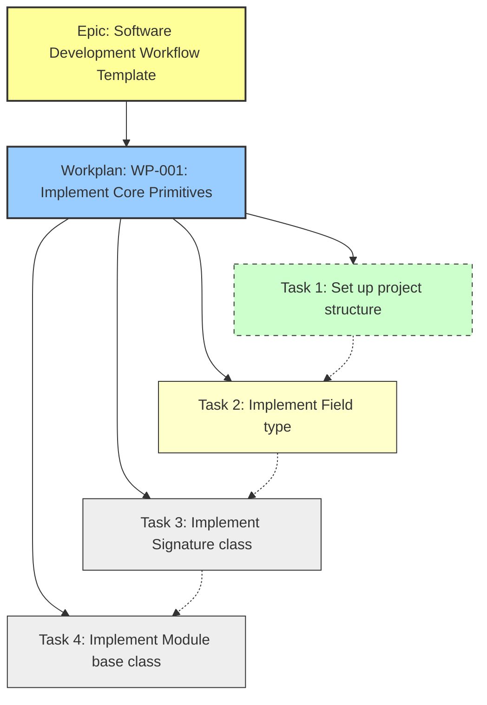

# Sample Implementation of Linear Structure for Workplans

This document provides a concrete example of how to implement the Linear structure for workplans using an existing workplan from the DSTy project.

## Example Workplan: Core Primitives Implementation

We'll use the "Implement Core Primitives for DSTyS" workplan as our example to demonstrate the Linear structure implementation.

### 1. Epic Structure

**Title**: Software Development Workflow Template: Master Issue

**Description**:
```
## Overview

This master issue serves as the top-level template for implementing the comprehensive software development workflow. It provides a structured approach to project planning, architecture, design, implementation, and review.

## Purpose

To establish a repeatable, high-quality process for software development that ensures thorough planning, clear requirements, solid architecture, and effective implementation.

## Key Components

* Product Requirements Document (PRD)
* Architecture Document
* UX/UI Plan (Optional)
* Project Overview
* Workplans
* Rules
* Spikes
* Reviews

## Deliverables

1. Complete set of template documents for each component
2. Example implementations for each template
3. Guidelines for using the templates
4. Integration with development workflow
```

**Labels**: Epic, Documentation

**Project**: DSTyS

**Status**: In Progress

### 2. Workplan Structure

**Title**: WP-001: Implement Core Primitives for DSTyS

**Description**:
```
## Document Information
- **Workplan ID**: WP-001
- **Project**: DSTyS (DSPy in TypeScript with Effect)
- **Document Version**: 1.0
- **Last Updated**: 2025-05-20
- **Author(s)**: Codegen
- **Status**: Draft
- **Approvers**: [Technical Lead, AI Specialist]

## 1. Objective

### 1.1 Purpose
This workplan aims to implement the core primitives of the DSTyS library, including Signatures, Modules, and Predictors. These primitives form the foundation of the entire library and enable the composition of AI pipelines using foundation models.

### 1.2 Scope
This workplan covers the implementation of:
- Signature class and related utilities
- Module base class and core functionality
- Predictor interface and basic implementation
- Field type definitions and validation
- Integration with Effect for error handling and functional programming patterns

This workplan does not include:
- Language model client implementations (covered in a separate workplan)
- Advanced prediction modules (covered in separate workplans)
- Optimization components (covered in separate workplans)
- Retrieval components (covered in separate workplans)

### 1.3 Expected Outcomes
- A fully implemented and tested Signature class that supports type definitions and validation
- A fully implemented and tested Module base class that can be extended for specific use cases
- A fully implemented and tested Predictor interface that defines how modules interact with foundation models
- Integration with Effect for robust error handling and functional programming patterns
- Comprehensive unit tests for all implemented components
- Documentation for all public APIs

## 2. Prerequisites

### 2.1 Dependencies
| Dependency | Type | Status | Notes |
|------------|------|--------|-------|
| Project Setup | Technical | Complete | Basic project structure, build system, and CI/CD pipeline must be set up |
| TypeScript Configuration | Technical | Complete | TypeScript must be configured with appropriate settings for the project |
| Effect Library | Technical | Complete | Effect library must be installed and available |
| Zod Library | Technical | Complete | Zod library must be installed for runtime type validation |
| Architecture Decision Record (ADR) | Technical | Complete | ADR for Effect integration patterns must be approved |

### 2.2 Required Resources
| Resource | Type | Availability | Notes |
|----------|------|--------------|-------|
| TypeScript Developer | Personnel | Available | Developer with strong TypeScript and functional programming experience |
| AI Specialist | Personnel | Available | Specialist familiar with DSPy and foundation models |
| Development Environment | Environment | Available | Node.js 20+, TypeScript 5.0+, and required dependencies |
| Python DSPy Codebase | Tool | Available | Access to Python DSPy codebase for reference |
| Unit Testing Framework | Tool | Available | Vitest or similar testing framework |

### 2.3 Knowledge Requirements
- Strong understanding of TypeScript's type system, including generics and conditional types
- Familiarity with functional programming concepts and patterns
- Understanding of the Effect library and its core concepts
- Knowledge of the Python DSPy framework and its core primitives
- Experience with test-driven development practices

## 3. Detailed Tasks
[Summary of tasks - detailed tasks are created as sub-issues]

## 4. Technical Specifications
[Summary of technical specifications]

## 5. Testing Strategy
[Summary of testing strategy]

## 6. Implementation Guidance
[Summary of implementation guidance]

## 7. Review Checklist
[Summary of review checklist]

## Documentation URL
[Link to the workplan document in the repository]
```

**Parent**: Software Development Workflow Template: Master Issue

**Labels**: Workplan, Core, Documentation

**Custom Fields**:
- Workplan ID: WP-001
- Document Version: 1.0
- Estimated Effort: 144 hours
- Documentation URL: https://github.com/helaix/DSTyS/blob/main/docs/planning/workplans/CORE-PrimitiveImplementation.md

**Assignee**: TypeScript Developer

**Project**: DSTyS

**Status**: In Progress

### 3. Task Structure

#### Task 1

**Title**: Set up project structure for core primitives

**Description**:
```
## Task Description
Set up the initial project structure for the core primitives of the DSTyS library, including directory structure, base files, and configuration.

## Implementation Details
1. Create a `src/core` directory for core primitives
2. Create subdirectories for each primitive type:
   - `src/core/field`
   - `src/core/signature`
   - `src/core/module`
   - `src/core/predictor`
3. Set up barrel files for each directory
4. Configure TypeScript paths for easy imports
5. Set up test directories for each primitive

## Acceptance Criteria
- [ ] Directory structure is created
- [ ] Barrel files are set up for clean exports
- [ ] TypeScript paths are configured
- [ ] Test directories are set up
- [ ] Basic README files are created for each primitive

## Parent Workplan
WP-001: Implement Core Primitives for DSTyS

## Estimated Effort
4 hours
```

**Parent**: WP-001: Implement Core Primitives for DSTyS

**Labels**: Task, Core, Infrastructure

**Assignee**: TypeScript Developer

**Estimate**: 4 hours

**Status**: Done

#### Task 2

**Title**: Implement Field type and validation

**Description**:
```
## Task Description
Implement the Field type and validation functionality, which is the foundation for defining and validating data structures in the DSTyS library.

## Implementation Details
1. Create a Field interface that defines:
   - Type information using Zod
   - Description for documentation
   - Required/optional status
   - Default value handling
   - Validation function
2. Implement the Field factory function
3. Implement validation logic using Effect for error handling
4. Create utility functions for common field types
5. Ensure proper TypeScript typing for type inference

## Acceptance Criteria
- [ ] Field interface is defined with proper TypeScript typing
- [ ] Field factory function is implemented
- [ ] Validation logic works correctly for various data types
- [ ] Error handling uses Effect for functional error management
- [ ] Common field type utilities are implemented
- [ ] Unit tests cover all functionality
- [ ] Documentation is complete

## Parent Workplan
WP-001: Implement Core Primitives for DSTyS

## Estimated Effort
8 hours
```

**Parent**: WP-001: Implement Core Primitives for DSTyS

**Labels**: Task, Core

**Assignee**: TypeScript Developer

**Estimate**: 8 hours

**Status**: In Progress

#### Task 3

**Title**: Implement Signature class with Effect integration

**Description**:
```
## Task Description
Implement the Signature class that defines the input and output types for modules, with full Effect integration for error handling.

## Implementation Details
1. Create a Signature interface that defines:
   - Collection of Field objects
   - Validation function for input data
   - Schema generation for documentation
   - Type inference helpers
2. Implement the Signature factory function
3. Implement validation logic using Effect for error handling
4. Create utility functions for common signature patterns
5. Ensure proper TypeScript typing for type inference

## Acceptance Criteria
- [ ] Signature interface is defined with proper TypeScript typing
- [ ] Signature factory function is implemented
- [ ] Validation logic works correctly for complex data structures
- [ ] Error handling uses Effect for functional error management
- [ ] Type inference works correctly for TypeScript
- [ ] Unit tests cover all functionality
- [ ] Documentation is complete

## Parent Workplan
WP-001: Implement Core Primitives for DSTyS

## Estimated Effort
16 hours
```

**Parent**: WP-001: Implement Core Primitives for DSTyS

**Labels**: Task, Core

**Assignee**: TypeScript Developer

**Estimate**: 16 hours

**Status**: Todo

#### Task 4

**Title**: Implement Module base class

**Description**:
```
## Task Description
Implement the Module base class that serves as the foundation for all modules in the DSTyS library.

## Implementation Details
1. Create a Module interface that defines:
   - Input and output signatures
   - Forward function for processing data
   - Composition functionality
   - Configuration options
2. Implement the Module factory function
3. Implement forward logic using Effect for error handling
4. Implement composition functionality
5. Ensure proper TypeScript typing for type inference

## Acceptance Criteria
- [ ] Module interface is defined with proper TypeScript typing
- [ ] Module factory function is implemented
- [ ] Forward logic works correctly for data processing
- [ ] Composition functionality allows chaining modules
- [ ] Error handling uses Effect for functional error management
- [ ] Type inference works correctly for TypeScript
- [ ] Unit tests cover all functionality
- [ ] Documentation is complete

## Parent Workplan
WP-001: Implement Core Primitives for DSTyS

## Estimated Effort
16 hours
```

**Parent**: WP-001: Implement Core Primitives for DSTyS

**Labels**: Task, Core

**Assignee**: TypeScript Developer

**Estimate**: 16 hours

**Status**: Todo

### 4. Relationships and Dependencies

**Parent-Child Relationships**:
- Epic (Software Development Workflow Template) → Workplan (WP-001)
- Workplan (WP-001) → Tasks (Tasks 1-4)

**Dependencies**:
- Task 1 → Task 2 (Task 2 depends on Task 1)
- Task 2 → Task 3 (Task 3 depends on Task 2)
- Task 3 → Task 4 (Task 4 depends on Task 3)

**Cycle Assignment**:
- All tasks are assigned to the current cycle (Cycle 110)

### 5. Visual Representation



## Migration Steps for Existing Workplans

To migrate existing workplans to this structure, follow these steps:

1. **Identify Existing Workplans**:
   - Review all workplan documents in `docs/planning/workplans/`
   - Create an inventory with workplan IDs, titles, and status

2. **Create Epic Structure**:
   - Create epics for major features or components
   - Link related workplans to each epic

3. **Create Workplan Issues**:
   - Create Linear issues for each workplan document
   - Follow the structure outlined above
   - Link to the appropriate epic

4. **Create Task Issues**:
   - Create sub-issues for each task in the workplans
   - Link to the appropriate workplan
   - Set dependencies between tasks

5. **Apply Metadata**:
   - Add labels to all issues
   - Fill in custom fields
   - Set appropriate status

6. **Verify Structure**:
   - Ensure all relationships are correctly established
   - Verify that the hierarchy is consistent
   - Check that all metadata is correctly applied

## Conclusion

This sample implementation demonstrates how to apply the Linear structure to an existing workplan. By following this example, you can create a consistent, scalable system for representing workplans in Linear that maintains alignment with the documentation templates while supporting effective project management.

