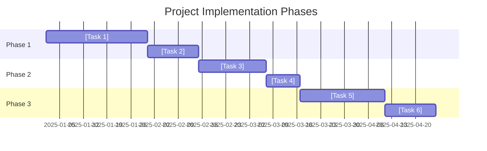
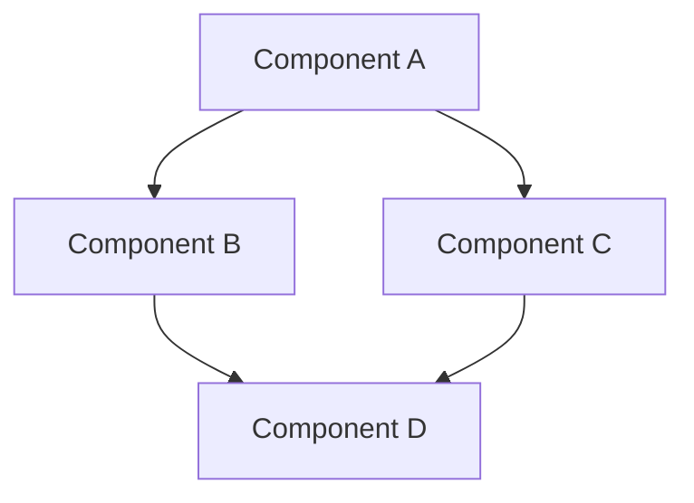
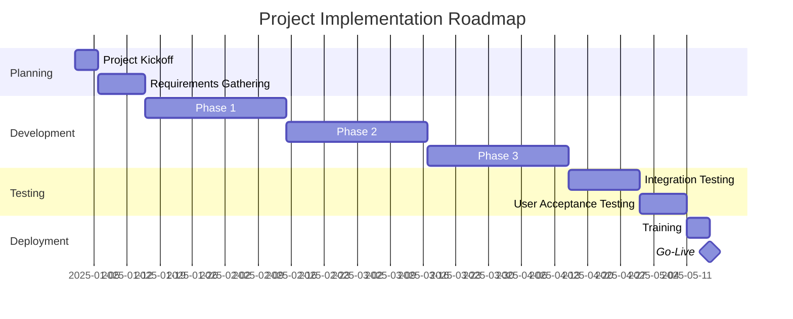

# Project Overview: [Project Name]

## Document Information
- **Project Name**: [Project Name]
- **Document Version**: [Version Number]
- **Last Updated**: [YYYY-MM-DD]
- **Author(s)**: [Author Names]
- **Status**: [Draft/In Review/Approved]
- **Approvers**: [Stakeholder Names]

## 1. Project Summary

### 1.1 Overview
[Provide a concise overview of the project, including its purpose and goals. This should be a high-level description that anyone in the organization can understand.]

### 1.2 Business Value
[Explain the business value this project delivers. How does it align with organizational goals? What problems does it solve?]

### 1.3 Key Objectives
[List the primary objectives of the project in bullet form. These should be specific, measurable, achievable, relevant, and time-bound (SMART).]

- [Objective 1]
- [Objective 2]
- [Objective 3]

### 1.4 Success Criteria
[Define how success will be measured for this project. What metrics or outcomes will indicate that the project has achieved its goals?]

## 2. Dependencies and Prerequisites

### 2.1 System Dependencies
[List the systems, services, or platforms that this project depends on.]

| Dependency | Version/Details | Purpose | Status |
|------------|----------------|---------|--------|
| [System 1] | [Version] | [Purpose] | [Available/Pending/To Be Developed] |
| [System 2] | [Version] | [Purpose] | [Available/Pending/To Be Developed] |
| [System 3] | [Version] | [Purpose] | [Available/Pending/To Be Developed] |

### 2.2 Technical Prerequisites
[Describe the technical prerequisites that must be in place before implementation can begin.]

- [Prerequisite 1]
- [Prerequisite 2]
- [Prerequisite 3]

### 2.3 External Dependencies
[List any external dependencies, such as third-party services, APIs, or data sources.]

| External Dependency | Provider | Purpose | Integration Status |
|--------------------|----------|---------|-------------------|
| [Dependency 1] | [Provider] | [Purpose] | [Not Started/In Progress/Complete] |
| [Dependency 2] | [Provider] | [Purpose] | [Not Started/In Progress/Complete] |
| [Dependency 3] | [Provider] | [Purpose] | [Not Started/In Progress/Complete] |

### 2.4 Team Dependencies
[Identify dependencies on other teams or departments.]

| Team/Department | Dependency Description | Timeline | Status |
|----------------|------------------------|----------|--------|
| [Team 1] | [Description] | [Timeline] | [Not Started/In Progress/Complete] |
| [Team 2] | [Description] | [Timeline] | [Not Started/In Progress/Complete] |
| [Team 3] | [Description] | [Timeline] | [Not Started/In Progress/Complete] |

## 3. Implementation Phases

### 3.1 Phase Overview
[Provide a high-level overview of the implementation phases, including their sequence and general timeline.]

### 3.2 Phase 1: [Phase Name]
[Describe the first phase of implementation, including its goals, scope, and timeline.]

**Timeline**: [Start Date] - [End Date]

**Key Deliverables**:
- [Deliverable 1]
- [Deliverable 2]
- [Deliverable 3]

**Exit Criteria**:
- [Criterion 1]
- [Criterion 2]
- [Criterion 3]

### 3.3 Phase 2: [Phase Name]
[Describe the second phase of implementation, including its goals, scope, and timeline.]

**Timeline**: [Start Date] - [End Date]

**Key Deliverables**:
- [Deliverable 1]
- [Deliverable 2]
- [Deliverable 3]

**Exit Criteria**:
- [Criterion 1]
- [Criterion 2]
- [Criterion 3]

### 3.4 Phase 3: [Phase Name]
[Describe the third phase of implementation, including its goals, scope, and timeline.]

**Timeline**: [Start Date] - [End Date]

**Key Deliverables**:
- [Deliverable 1]
- [Deliverable 2]
- [Deliverable 3]

**Exit Criteria**:
- [Criterion 1]
- [Criterion 2]
- [Criterion 3]

## 4. Major Components

### 4.1 Component Overview
[Provide a high-level overview of the major components of the system and how they interact.]

### 4.2 Component 1: [Component Name]
[Describe the first major component, including its purpose, functionality, and interfaces.]

**Purpose**: [Brief description of the component's purpose]

**Key Functionality**:
- [Function 1]
- [Function 2]
- [Function 3]

**Interfaces**:
- **Input**: [Description of input interfaces]
- **Output**: [Description of output interfaces]
- **Dependencies**: [Other components this component depends on]

### 4.3 Component 2: [Component Name]
[Describe the second major component, including its purpose, functionality, and interfaces.]

**Purpose**: [Brief description of the component's purpose]

**Key Functionality**:
- [Function 1]
- [Function 2]
- [Function 3]

**Interfaces**:
- **Input**: [Description of input interfaces]
- **Output**: [Description of output interfaces]
- **Dependencies**: [Other components this component depends on]

### 4.4 Component 3: [Component Name]
[Describe the third major component, including its purpose, functionality, and interfaces.]

**Purpose**: [Brief description of the component's purpose]

**Key Functionality**:
- [Function 1]
- [Function 2]
- [Function 3]

**Interfaces**:
- **Input**: [Description of input interfaces]
- **Output**: [Description of output interfaces]
- **Dependencies**: [Other components this component depends on]

## 5. Implementation Chunks

### 5.1 Chunk Overview
[Provide an overview of how the implementation is broken down into manageable chunks. Explain the approach to chunking and how chunks relate to components and phases.]

### 5.2 Chunk 1: [Chunk Name]
[Describe the first implementation chunk in detail.]

**Description**: [Brief description of what this chunk entails]

**Component(s)**: [Which major component(s) this chunk is part of]

**Phase**: [Which implementation phase this chunk belongs to]

**Estimated Effort**: [Low/Medium/High] or [Story Points] or [Person-Days]

**Dependencies**:
- [Dependency 1]
- [Dependency 2]

**Acceptance Criteria**:
- [Criterion 1]
- [Criterion 2]
- [Criterion 3]

### 5.3 Chunk 2: [Chunk Name]
[Describe the second implementation chunk in detail.]

**Description**: [Brief description of what this chunk entails]

**Component(s)**: [Which major component(s) this chunk is part of]

**Phase**: [Which implementation phase this chunk belongs to]

**Estimated Effort**: [Low/Medium/High] or [Story Points] or [Person-Days]

**Dependencies**:
- [Dependency 1]
- [Dependency 2]

**Acceptance Criteria**:
- [Criterion 1]
- [Criterion 2]
- [Criterion 3]

### 5.4 Chunk 3: [Chunk Name]
[Describe the third implementation chunk in detail.]

**Description**: [Brief description of what this chunk entails]

**Component(s)**: [Which major component(s) this chunk is part of]

**Phase**: [Which implementation phase this chunk belongs to]

**Estimated Effort**: [Low/Medium/High] or [Story Points] or [Person-Days]

**Dependencies**:
- [Dependency 1]
- [Dependency 2]

**Acceptance Criteria**:
- [Criterion 1]
- [Criterion 2]
- [Criterion 3]

## 6. Risk Assessment

### 6.1 Risk Overview
[Provide an overview of the risk assessment approach and key risk areas.]

### 6.2 Risk Matrix
[Present a risk matrix showing the likelihood and impact of identified risks.]

| Risk ID | Risk Description | Likelihood (L/M/H) | Impact (L/M/H) | Risk Level | Mitigation Strategy | Owner |
|---------|------------------|-------------------|----------------|------------|---------------------|-------|
| R1 | [Risk 1] | [L/M/H] | [L/M/H] | [Low/Medium/High] | [Strategy] | [Owner] |
| R2 | [Risk 2] | [L/M/H] | [L/M/H] | [Low/Medium/High] | [Strategy] | [Owner] |
| R3 | [Risk 3] | [L/M/H] | [L/M/H] | [Low/Medium/High] | [Strategy] | [Owner] |
| R4 | [Risk 4] | [L/M/H] | [L/M/H] | [Low/Medium/High] | [Strategy] | [Owner] |
| R5 | [Risk 5] | [L/M/H] | [L/M/H] | [Low/Medium/High] | [Strategy] | [Owner] |

### 6.2.1 Realism of Effort Estimates and Timelines
[Acknowledge that initial estimates are approximate. Note if/when a re-evaluation will occur, factoring in complexities like Python-to-TypeScript translation, Effect TS learning curve, and TDD overhead. Consider mentioning a "Complexity/Uncertainty Multiplier" for foundational pieces.]

### 6.3 Technical Risks
[Describe specific technical risks and their mitigation strategies.]

| Risk ID | Technical Risk | Mitigation Strategy |
|---------|---------------|---------------------|
| TR1 | [Technical Risk 1] | [Mitigation Strategy] |
| TR2 | [Technical Risk 2] | [Mitigation Strategy] |
| TR3 | [Technical Risk 3] | [Mitigation Strategy] |

### 6.4 Schedule Risks
[Describe specific schedule risks and their mitigation strategies.]

| Risk ID | Schedule Risk | Mitigation Strategy |
|---------|--------------|---------------------|
| SR1 | [Schedule Risk 1] | [Mitigation Strategy] |
| SR2 | [Schedule Risk 2] | [Mitigation Strategy] |
| SR3 | [Schedule Risk 3] | [Mitigation Strategy] |

### 6.5 Resource Risks
[Describe specific resource risks and their mitigation strategies.]

| Risk ID | Resource Risk | Mitigation Strategy |
|---------|--------------|---------------------|
| RR1 | [Resource Risk 1] | [Mitigation Strategy] |
| RR2 | [Resource Risk 2] | [Mitigation Strategy] |
| RR3 | [Resource Risk 3] | [Mitigation Strategy] |

## 7. Implementation Roadmap

### 7.1 High-Level Timeline
[Provide a high-level timeline for the entire project implementation.]

### 7.2 Key Milestones
[List the key milestones for the project implementation.]

| Milestone | Description | Target Date | Dependencies |
|-----------|-------------|-------------|--------------|
| M1 | [Milestone 1] | [Date] | [Dependencies] |
| M2 | [Milestone 2] | [Date] | [Dependencies] |
| M3 | [Milestone 3] | [Date] | [Dependencies] |
| M4 | [Milestone 4] | [Date] | [Dependencies] |
| M5 | [Milestone 5] | [Date] | [Dependencies] |

### 7.3 Resource Allocation
[Describe how resources will be allocated across the implementation phases and chunks.]

| Role | Phase 1 | Phase 2 | Phase 3 | Total Allocation |
|------|---------|---------|---------|------------------|
| [Role 1] | [Allocation] | [Allocation] | [Allocation] | [Total] |
| [Role 2] | [Allocation] | [Allocation] | [Allocation] | [Total] |
| [Role 3] | [Allocation] | [Allocation] | [Allocation] | [Total] |

### 7.4 Explicit Critical Path
[Identify and visualize the critical path through the project (sequence of tasks that directly impacts the final delivery date). This helps in prioritizing and managing risks.]

### 7.5 Strategy for Upstream Changes (During Development)
[Briefly outline the policy for handling major releases or breaking changes from upstream dependencies (e.g., the Python library being ported) that occur *during* this project's development cycle. Will development pause to incorporate them, or stick to the original target version for this release?]

### 7.6 Definition of Done (DoD) for Phases
[Provide a brief, formal Definition of Done for each major project phase, aligned with PRD success metrics and key deliverables for that phase. E.g., "Phase 1 Done when: Core Primitives pass all tests, CI/CD is green, ADR for X is approved, Y example is functional."]

### 7.7 Developer Onboarding and Knowledge Transfer
[Briefly mention any planned activities for developer onboarding, knowledge sharing (e.g., internal workshops on key technologies/patterns), or pair programming for complex modules, especially if the project involves specialized or new technologies for the team.]

## 8. Appendices

### 8.1 Glossary
[Define key terms and acronyms used in this document.]

| Term | Definition |
|------|------------|
| [Term 1] | [Definition] |
| [Term 2] | [Definition] |
| [Term 3] | [Definition] |

### 8.2 References
[List references to other documents, standards, or resources.]

- [Reference 1]
- [Reference 2]
- [Reference 3]

### 8.3 Revision History
[Track changes to this document over time.]

| Version | Date | Author | Description of Changes |
|---------|------|--------|------------------------|
| [Version] | [Date] | [Author] | [Description] |
| [Version] | [Date] | [Author] | [Description] |
| [Version] | [Date] | [Author] | [Description] |

---

## Notes on Using This Template

This Project Overview template follows the process outlined in the issue:
1. Review all previous documents (PRD, Architecture, UX/UI Plan)
2. Identify major components and dependencies
3. Break down components into implementation chunks
4. Organize chunks into logical phases
5. Assess risks and develop mitigation strategies
6. Review with technical and product stakeholders

When using this template:
1. **Start with existing documentation**: Review the PRD, Architecture Document, and UX/UI Plan to understand the project requirements and technical approach.
2. **Identify components**: Break down the system into major functional components.
3. **Define phases**: Organize the implementation into logical phases based on dependencies and priorities.
4. **Create implementation chunks**: Break down components into manageable units of work.
5. **Assess risks**: Identify potential risks and develop mitigation strategies.
6. **Create a roadmap**: Develop a timeline with key milestones and resource allocations.
7. **Review with stakeholders**: Share the document with technical and product stakeholders for feedback.

Remember that a good Project Overview should:
- Provide a clear roadmap for implementation
- Break down complex systems into manageable chunks
- Identify dependencies and prerequisites
- Assess and mitigate risks
- Establish a realistic timeline and resource allocation