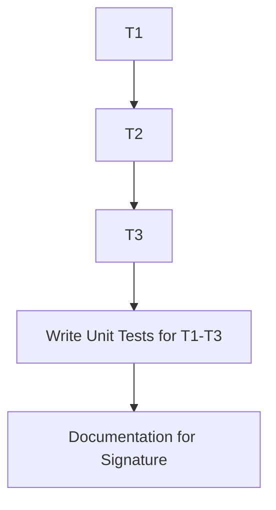
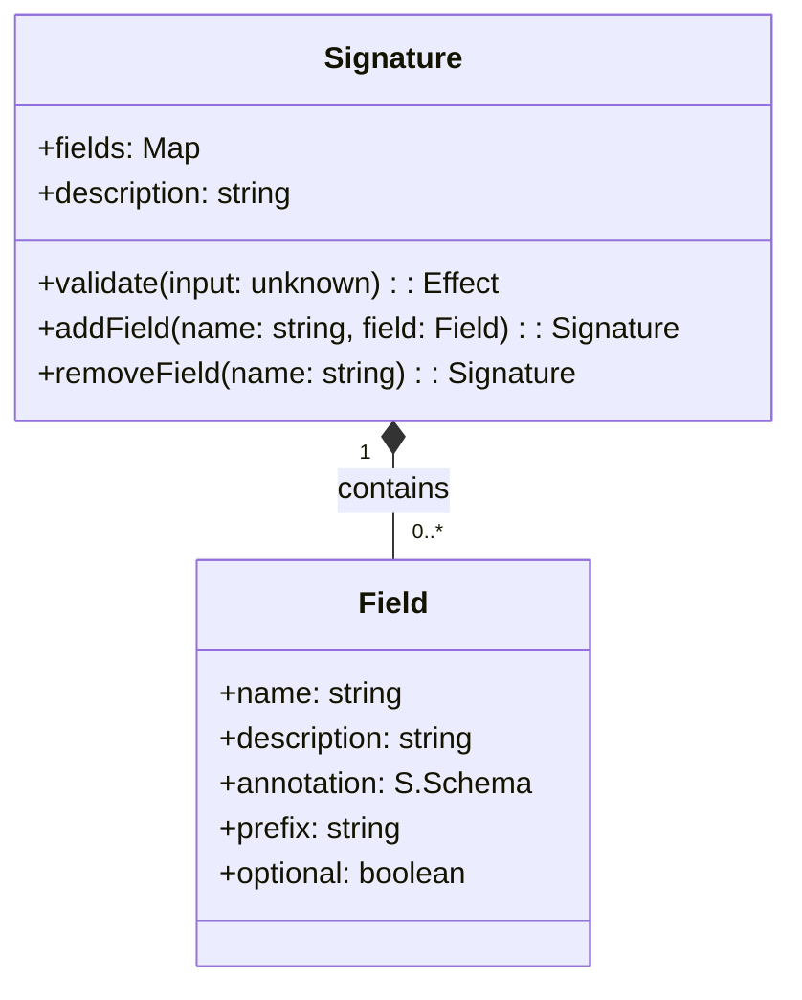
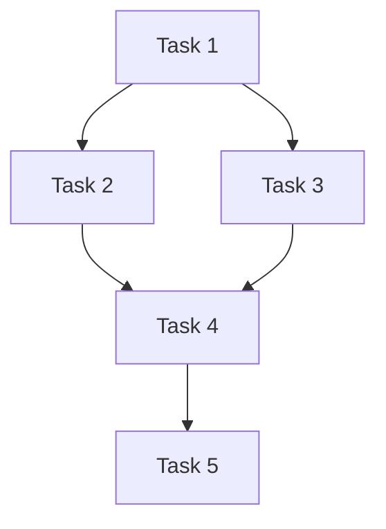
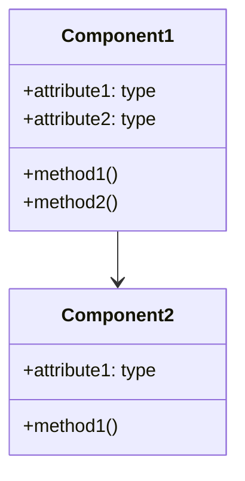

# Workplan: [Workplan Title]

## Document Information
- **Workplan ID**: [WP-XXX] (e.g., P0-CORE-001-WP1)
- **Project**: DSTyS (DSPy in TypeScript with Effect)
- **Document Version**: [Version Number]
- **Last Updated**: [YYYY-MM-DD]
- **Author(s)**: [Author Names]
- **Status**: [Not Started/Draft/In Progress/Blocked/In Review/Completed]
- **Approvers**: [Stakeholder Names, e.g., Technical Lead, AI Specialist]
- **Target Primary Agent(s)**: [e.g., "Codex", "CodeGen", "Human+Cursor"] (Critical for tailoring detail level)
- **Linear Ticket(s)**: [Link to relevant Linear tickets]

## 1. Objective

### 1.1 Purpose
[Provide a clear, concise statement of what this workplan aims to achieve. This should be specific and focused on the implementation goal, referencing the component from the Project Overview.]

### 1.2 Scope
**In Scope:**
[List what is explicitly included in this workplan.]
- ...
- ...

**Out of Scope:**
[List what is explicitly excluded from this workplan.]
- ...
- ...

### 1.3 Expected Outcomes & Deliverables
[List the specific deliverables and outcomes that will result from completing this workplan. These should be tangible and verifiable.]
- [Deliverable 1: e.g., Fully implemented and tested `Signature.ts` module]
- [Deliverable 2: e.g., Unit tests for `Signature.ts` achieving >90% coverage]
- [Deliverable 3: e.g., JSDoc/TSDoc comments for all public APIs in `Signature.ts`]

## 2. Prerequisites

### 2.1 Dependencies
[List all dependencies that must be completed before this workplan can be implemented. Include Workplan IDs, document states, or specific features.]

| Dependency ID / Name | Type (Technical/Resource/External) | Status (Not Started/In Progress/Complete) | Notes |
|----------------------|------------------------------------|-------------------------------------------|-------|
| [WP-YYY]             | Technical                          | [Status]                                  | [e.g., Core FieldImplementation must be merged] |
| [Arch Doc v1.1]      | Document                           | Approved                                  | [e.g., Relevant sections 3.2, 4.1] |

### 2.2 Required Resources
[List all resources required to complete this workplan.]

| Resource             | Type (Personnel/Tool/Environment/API Access) | Availability (Available/Pending) | Notes |
|----------------------|----------------------------------------------|----------------------------------|-------|
| [TypeScript Dev]     | Personnel                                    | Available                        | [e.g., Familiar with EffectTS] |
| [Python DSPy Codebase] | Tool                                         | Available                        | [e.g., For reference of class X] |
| [OpenAI API Key]     | API Access                                   | Pending                          | [e.g., For testing LM client] |

### 2.3 Knowledge Requirements
[Specify any specialized knowledge or skills required to implement this workplan.]
- [e.g., Deep understanding of Python DSPy's `Signature` class internals]
- [e.g., Proficiency with EffectTS `Schema` and `Effect.validate`]
- [e.g., Experience writing Vitest unit tests for asynchronous EffectTS code]

## 3. Detailed Tasks

### 3.1 Task Breakdown
[Break down the implementation into specific, actionable tasks. Each task should be small enough to be completed in a reasonable timeframe. For AI Agents like Codex, these tasks need to be very granular.]

| Task ID | Task Description                                     | Estimated Effort (Person-Hours) | Dependencies | Assignee | Status |
|---------|------------------------------------------------------|---------------------------------|--------------|----------|--------|
| T1      | [e.g., Analyze Python `Signature` class methods]     | 4                               | -            | [Name]   | Open   |
| T2      | [e.g., Define `Signature.ts` interface in TypeScript] | 6                               | T1           | [Name]   | Open   |
| T3      | [e.g., Implement `Signature.validate()` using Effect] | 8                               | T2           | [Name]   | Open   |
| ...     | ...                                                  | ...                             | ...          | ...      | ...    |

### 3.2 Task Sequence
[Describe the sequence in which tasks should be completed. Include any parallel work that can be done. A Mermaid diagram is useful here.]



### 3.3 Milestones
[Define key milestones for tracking progress within this workplan.]

| Milestone ID | Description                                  | Target Date | Tasks Completed |
|--------------|----------------------------------------------|-------------|-----------------|
| M1           | [e.g., Initial `Signature.ts` structure defined] | [Date]      | T1, T2          |
| M2           | [e.g., Core validation logic implemented]    | [Date]      | T3              |
| M3           | [e.g., All unit tests passing]               | [Date]      | T4              |

## 4. Technical Specifications

### 4.1 Architecture Context
[Describe how this implementation fits into the overall system architecture. Reference relevant sections of the Architecture Document (e.g., `docs/planning/Architecture.md`).]

### 4.2 Design Details
[Provide detailed design information specific to this implementation chunk. Include diagrams, data models, algorithms, etc. as appropriate. **This section must be extremely detailed if the Target Agent is Codex.**]

#### 4.2.1 Component Design
[Describe the design of the components to be implemented. Include class diagrams, sequence diagrams if helpful.]



#### 4.2.2 Data Models / Schemas (using `@effect/schema`)
[Define any data structures or schemas using `@effect/schema` that are central to this workplan.]
```typescript
import * as S from "@effect/schema/Schema";

export const MyDataSchema = S.struct({
  id: S.UUID,
  content: S.string,
  // ... other fields
});
export type MyData = S.Schema.To<typeof MyDataSchema>;
```

#### 4.2.3 API Specifications (Public methods, function signatures)
[Define any public APIs that will be implemented or modified. Include full TypeScript signatures.]
```typescript
export function createSignature(
  definition: Record<string, FieldDefinition>,
  description?: string
): Effect.Effect<never, InvalidSignatureError, SignatureService>;

export interface SignatureService {
  readonly validate: (data: unknown) => Effect.Effect<never, ValidationError, ValidatedData>;
  // ... other methods
}
```

### 4.3 Technical Constraints
[List any technical constraints or limitations that must be considered during implementation (e.g., specific library versions, performance targets for this chunk).]
- Must use Effect >= 3.0
- Must be compatible with Node.js >= 20.0
- ...

### 4.4 Dependencies on Other Components (Internal)
[Describe how this implementation depends on other DSTyS components and how they interact.]

| Component Name | Interaction Type (Uses/Extends/Implements) | Interface/API Used | Notes |
|----------------|--------------------------------------------|--------------------|-------|
| [Field.ts]     | Uses                                       | `Field.validate()` | [e.g., Signature uses Field for validation] |
| ...            | ...                                        | ...                | ...   |

## 5. Testing Strategy

### 5.1 Testing Approach
[Describe the overall approach to testing this implementation. Refer to TDD principles. Specify if tests should be written before, during, or after implementation for this chunk.]

### 5.2 Test Cases
[List specific test cases that should be implemented to verify this implementation. For AI Agents like Codex, these must be very specific and cover happy paths, edge cases, and error conditions.]

| Test ID | Test Description                                       | Test Type (Unit/Integration) | Test Data / Inputs                                  | Expected Result / Assertion(s)                               |
|---------|--------------------------------------------------------|------------------------------|-----------------------------------------------------|--------------------------------------------------------------|
| TC1     | [e.g., Signature validation with correct input]        | Unit                         | `{ question: "Hi?", answer: "Hello" }`             | `validate(input)` succeeds, returns validated object.        |
| TC2     | [e.g., Signature validation with missing required field] | Unit                         | `{ question: "Hi?" }` (answer missing)              | `validate(input)` fails with `MissingFieldError`.            |
| TC3     | [e.g., Signature validation with incorrect type]       | Unit                         | `{ question: 123, answer: "Hello" }`                | `validate(input)` fails with `TypeMismatchError`.            |
| ...     | ...                                                    | ...                          | ...                                                 | ...                                                          |

### 5.3 Test Environment
[Describe the environment required for testing (e.g., specific Node version, Vitest setup, any mock services needed).]

### 5.4 Test Data
[Describe any specific test data that needs to be created or acquired for these tests.]

### 5.5 Performance Testing (if applicable)
[Describe any performance testing that should be conducted for this chunk.]

## 6. Implementation Guidance

### 6.1 Best Practices
[Provide guidance on best practices to follow during implementation (e.g., specific EffectTS patterns, coding style, error handling conventions for this chunk).]
- All fallible operations MUST return an `Effect.Effect<E, A>`.
- Use `Schema.decodeUnknown` for parsing external data.
- ...

### 6.2 Code Examples / Snippets
[Provide example code snippets or references to similar implementations that can guide the developer. This is very helpful for AI agents.]
```typescript
// Example of using Effect.gen for a sequence of operations
const processAndValidate = (input: unknown) =>
  Effect.gen(function*(_) {
    const parsed = yield* _(S.parse(MyInputSchema)(input));
    const result = yield* _(processData(parsed)); // processData returns an Effect
    return result;
  });
```

### 6.3 Potential Challenges & Pitfalls
[Identify potential challenges or pitfalls that might be encountered during implementation and how to address them.]

| Challenge                                       | Impact (High/Medium/Low) | Mitigation Strategy / Notes                                  |
|-------------------------------------------------|--------------------------|--------------------------------------------------------------|
| [e.g., Translating Python metaclass to TS]      | High                     | [e.g., Use factory functions or advanced generic types]      |
| [e.g., Ensuring type safety with dynamic keys]  | Medium                   | [e.g., Leverage `Record<string, unknown>` with Zod refinements] |

### 6.4 Security Considerations (for this chunk)
[Highlight any security considerations specific to this implementation chunk.]
- [e.g., Input sanitization for X field if it's used in a sensitive context later]
- ...

### 6.5 Performance Considerations (for this chunk)
[Highlight any performance considerations specific to this implementation chunk.]
- [e.g., Avoid excessive object cloning in Y function]
- ...

## 7. Review Checklist

### 7.1 Implementation Review Criteria
[Define the criteria that will be used to review the implementation of this specific chunk.]
- [ ] All tasks in section 3.1 are completed.
- [ ] Code adheres to the technical specifications in section 4.
- [ ] All specified test cases in section 5.2 pass.
- [ ] Code meets quality standards (see 7.2).
- [ ] Documentation requirements are met (see 7.3).

### 7.2 Code Quality Standards
[Define the code quality standards that must be met for this chunk.]
- Adherence to `_effect-ts.rules.mdc` and other relevant project rules.
- Code is well-commented, especially complex logic.
- No linting errors (as per project's ESLint/Biome config).
- ...

### 7.3 Documentation Requirements
[Define the documentation that must be created or updated as part of this implementation chunk.]
- JSDoc/TSDoc comments for all new public functions, classes, types.
- Update `README.md` for this component if significant changes.
- ...

### 7.4 Testing Verification
[Define how testing will be verified for this chunk.]
- All unit tests pass in CI.
- Code coverage for new/modified code is >= X%.
- ...

## 8. Decision Authority
- **Independent Decisions (Assignee can make without further approval):**
  - [e.g., Specific variable names, internal function structure as long as public API is met]
  - [e.g., Choice of Effect combinators for internal logic]
- **Requires Lead/User Input (Assignee MUST seek approval/clarification):**
  - [e.g., Any changes to the public API defined in 4.2.3]
  - [e.g., Significant deviations from the proposed implementation in 4.2]
  - [e.g., Introducing new third-party dependencies]

## 9. Questions/Uncertainties

### 9.1 Blocking Questions
[List questions that, if unanswered, will prevent progress on this workplan.]
- [Question 1...]
- [Question 2...]

### 9.2 Non-Blocking Questions / Clarifications Needed
[List questions that would be helpful to have answered but won't halt progress immediately.]
- [Question 1...]
- [Question 2...]

## 10. Acceptable Tradeoffs
[List any acceptable tradeoffs for this specific workplan, if discussed and approved (e.g., "Okay to defer performance optimization of X function for initial implementation if it meets functional requirements").]
- ...
- ...

## 11. Notes & Decisions Log
[A running log of important notes, decisions made during implementation, clarifications received, and reasons for any deviations from the original plan. Each entry should be timestamped.]
- **YYYY-MM-DD:** [Note or Decision...]
- **YYYY-MM-DD:** [Clarification on Question X: ...]

## 12. Appendices (Optional)

### 12.1 Glossary
[Define key terms and acronyms specific to this workplan, if any.]

### 12.2 References
[List references to other documents, standards, or resources specific to this workplan.]

### 12.3 Revision History
| Version | Date       | Author      | Description of Changes                                   |
|---------|------------|-------------|----------------------------------------------------------|
| 1.0     | YYYY-MM-DD | [Author(s)] | Initial draft of the workplan for [Workplan Title].      |
| ...     | ...        | ...         | ...                                                      |
# Workplan: [Workplan Title]

## Document Information
- **Workplan ID**: [WP-XXX]
- **Project**: [Project Name]
- **Document Version**: [Version Number]
- **Last Updated**: [YYYY-MM-DD]
- **Author(s)**: [Author Names]
- **Status**: [Draft/In Review/Approved]
- **Approvers**: [Stakeholder Names]

## 1. Objective

### 1.1 Purpose
[Provide a clear, concise statement of what this workplan aims to achieve. This should be specific and focused on the implementation goal.]

### 1.2 Scope
[Define the boundaries of this workplan. What is included and what is explicitly excluded from this implementation chunk.]

### 1.3 Expected Outcomes
[List the specific deliverables and outcomes that will result from completing this workplan.]

- [Outcome 1]
- [Outcome 2]
- [Outcome 3]

## 2. Prerequisites

### 2.1 Dependencies
[List all dependencies that must be completed before this workplan can be implemented.]

| Dependency | Type | Status | Notes |
|------------|------|--------|-------|
| [Dependency 1] | [Technical/Resource/External] | [Not Started/In Progress/Complete] | [Additional information] |
| [Dependency 2] | [Technical/Resource/External] | [Not Started/In Progress/Complete] | [Additional information] |
| [Dependency 3] | [Technical/Resource/External] | [Not Started/In Progress/Complete] | [Additional information] |

### 2.2 Required Resources
[List all resources required to complete this workplan.]

| Resource | Type | Availability | Notes |
|----------|------|--------------|-------|
| [Resource 1] | [Personnel/Tool/Environment] | [Available/Pending] | [Additional information] |
| [Resource 2] | [Personnel/Tool/Environment] | [Available/Pending] | [Additional information] |
| [Resource 3] | [Personnel/Tool/Environment] | [Available/Pending] | [Additional information] |

### 2.3 Knowledge Requirements
[Specify any specialized knowledge or skills required to implement this workplan.]

- [Knowledge/Skill 1]
- [Knowledge/Skill 2]
- [Knowledge/Skill 3]

## 3. Detailed Tasks

### 3.1 Task Breakdown
[Break down the implementation into specific, actionable tasks. Each task should be small enough to be completed in a reasonable timeframe (e.g., 1-2 days).]

| Task ID | Task Description | Estimated Effort | Dependencies | Assignee |
|---------|------------------|------------------|--------------|----------|
| T1 | [Task 1 description] | [Hours/Story Points] | [Dependencies] | [Assignee] |
| T2 | [Task 2 description] | [Hours/Story Points] | [Dependencies] | [Assignee] |
| T3 | [Task 3 description] | [Hours/Story Points] | [Dependencies] | [Assignee] |
| T4 | [Task 4 description] | [Hours/Story Points] | [Dependencies] | [Assignee] |
| T5 | [Task 5 description] | [Hours/Story Points] | [Dependencies] | [Assignee] |

### 3.2 Task Sequence
[Describe the sequence in which tasks should be completed. Include any parallel work that can be done.]



### 3.3 Milestones
[Define key milestones for tracking progress.]

| Milestone | Description | Target Date | Tasks Completed |
|-----------|-------------|-------------|-----------------|
| M1 | [Milestone 1] | [Date] | [T1, T2] |
| M2 | [Milestone 2] | [Date] | [T3, T4] |
| M3 | [Milestone 3] | [Date] | [T5] |

## 4. Technical Specifications

### 4.1 Architecture Context
[Describe how this implementation fits into the overall system architecture. Reference relevant sections of the Architecture Document.]

### 4.2 Design Details
[Provide detailed design information specific to this implementation chunk. Include diagrams, data models, algorithms, etc. as appropriate.]

#### 4.2.1 Component Design
[Describe the design of the components to be implemented.]



#### 4.2.2 Data Models
[Describe any data models or structures that will be implemented.]

```typescript
interface ExampleInterface {
  property1: string;
  property2: number;
  property3?: boolean;
}

type ExampleType = {
  field1: string;
  field2: number[];
  field3: Record<string, any>;
};
```

#### 4.2.3 API Specifications
[Define any APIs that will be implemented or modified.]

```typescript
// Example API definition
function exampleFunction(param1: string, param2: number): Promise<Result> {
  // Implementation details
}

class ExampleClass {
  constructor(options: Options) {
    // Implementation details
  }
  
  public method1(param: Type): ReturnType {
    // Implementation details
  }
}
```

### 4.3 Technical Constraints
[List any technical constraints or limitations that must be considered during implementation.]

- [Constraint 1]
- [Constraint 2]
- [Constraint 3]

### 4.4 Dependencies on Other Components
[Describe how this implementation depends on other system components and how they interact.]

| Component | Interaction Type | Interface | Notes |
|-----------|------------------|-----------|-------|
| [Component 1] | [Uses/Extends/Implements] | [Interface description] | [Additional information] |
| [Component 2] | [Uses/Extends/Implements] | [Interface description] | [Additional information] |
| [Component 3] | [Uses/Extends/Implements] | [Interface description] | [Additional information] |

## 5. Testing Strategy

### 5.1 Testing Approach
[Describe the overall approach to testing this implementation.]

### 5.2 Test Cases
[List specific test cases that should be implemented to verify this implementation.]

| Test ID | Test Description | Test Type | Test Data | Expected Result |
|---------|------------------|-----------|-----------|-----------------|
| TC1 | [Test case 1] | [Unit/Integration/System] | [Test data] | [Expected result] |
| TC2 | [Test case 2] | [Unit/Integration/System] | [Test data] | [Expected result] |
| TC3 | [Test case 3] | [Unit/Integration/System] | [Test data] | [Expected result] |
| TC4 | [Test case 4] | [Unit/Integration/System] | [Test data] | [Expected result] |
| TC5 | [Test case 5] | [Unit/Integration/System] | [Test data] | [Expected result] |

### 5.3 Test Environment
[Describe the environment required for testing.]

### 5.4 Test Data
[Describe any test data that needs to be created or acquired.]

### 5.5 Performance Testing
[Describe any performance testing that should be conducted.]

## 6. Implementation Guidance

### 6.1 Best Practices
[Provide guidance on best practices to follow during implementation.]

- [Best practice 1]
- [Best practice 2]
- [Best practice 3]

### 6.2 Code Examples
[Provide example code snippets or references to similar implementations that can guide the developer.]

```typescript
// Example implementation
function exampleImplementation() {
  // Implementation details
}
```

### 6.3 Potential Challenges
[Identify potential challenges or pitfalls that might be encountered during implementation and how to address them.]

| Challenge | Impact | Mitigation Strategy |
|-----------|--------|---------------------|
| [Challenge 1] | [High/Medium/Low] | [Strategy to address] |
| [Challenge 2] | [High/Medium/Low] | [Strategy to address] |
| [Challenge 3] | [High/Medium/Low] | [Strategy to address] |

### 6.4 Security Considerations
[Highlight any security considerations that should be addressed during implementation.]

- [Security consideration 1]
- [Security consideration 2]
- [Security consideration 3]

### 6.5 Performance Considerations
[Highlight any performance considerations that should be addressed during implementation.]

- [Performance consideration 1]
- [Performance consideration 2]
- [Performance consideration 3]

## 7. Review Checklist

### 7.1 Implementation Review Criteria
[Define the criteria that will be used to review the implementation.]

- [ ] [Criterion 1]
- [ ] [Criterion 2]
- [ ] [Criterion 3]
- [ ] [Criterion 4]
- [ ] [Criterion 5]

### 7.2 Code Quality Standards
[Define the code quality standards that must be met.]

- [ ] [Standard 1]
- [ ] [Standard 2]
- [ ] [Standard 3]
- [ ] [Standard 4]
- [ ] [Standard 5]

### 7.3 Documentation Requirements
[Define the documentation that must be created or updated as part of this implementation.]

- [ ] [Documentation item 1]
- [ ] [Documentation item 2]
- [ ] [Documentation item 3]

### 7.4 Testing Verification
[Define how testing will be verified.]

- [ ] [Verification item 1]
- [ ] [Verification item 2]
- [ ] [Verification item 3]

## 8. Appendices

### 8.1 Glossary
[Define key terms and acronyms used in this document.]

| Term | Definition |
|------|------------|
| [Term 1] | [Definition] |
| [Term 2] | [Definition] |
| [Term 3] | [Definition] |

### 8.2 References
[List references to other documents, standards, or resources.]

- [Reference 1]
- [Reference 2]
- [Reference 3]

### 8.3 Revision History
[Track changes to this document over time.]

| Version | Date | Author | Description of Changes |
|---------|------|--------|------------------------|
| [Version] | [Date] | [Author] | [Description] |
| [Version] | [Date] | [Author] | [Description] |
| [Version] | [Date] | [Author] | [Description] |

---

## Notes on Using This Template

This Workplan template is designed to provide detailed implementation instructions for each chunk identified in the Project Overview. It follows the process outlined in the issue:

1. Select chunks from Project Overview
2. Break down each chunk into detailed tasks
3. Define technical specifications for each task
4. Develop testing strategies
5. Create implementation guidance
6. Define review criteria

When using this template:

1. **Start with the Project Overview**: Review the Project Overview document to understand how this chunk fits into the overall project.
2. **Be specific and detailed**: Provide enough detail that a developer can implement the chunk without needing to ask many questions.
3. **Include all necessary technical specifications**: Diagrams, data models, API specifications, etc.
4. **Define clear testing criteria**: Ensure that the implementation can be properly tested and verified.
5. **Provide helpful guidance**: Include best practices, code examples, and potential challenges.
6. **Set clear review criteria**: Define what a successful implementation looks like.

Remember that a good Workplan should:
- Provide clear, actionable tasks
- Include detailed technical specifications
- Define comprehensive testing strategies
- Offer practical implementation guidance
- Establish objective review criteria
