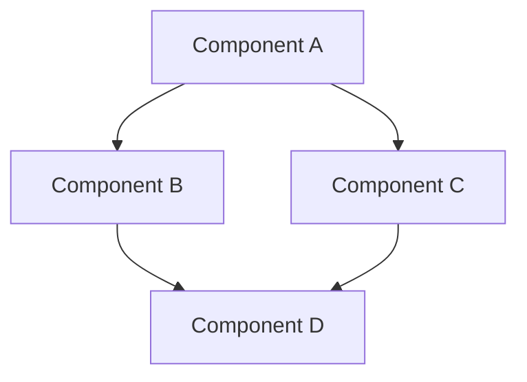
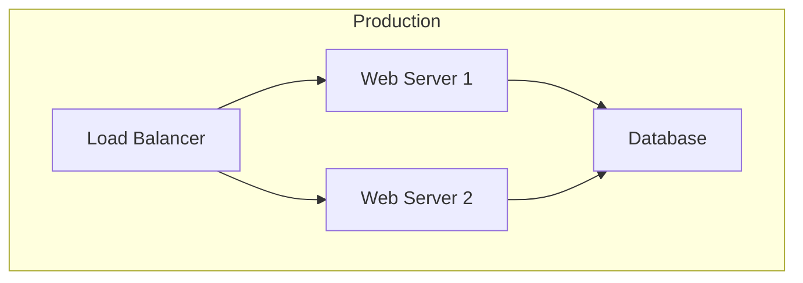
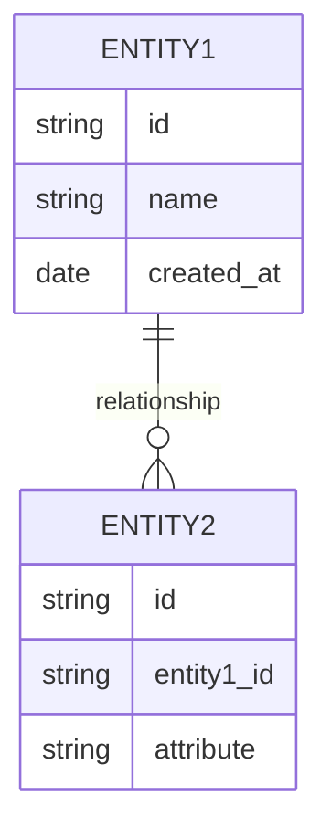

# Architecture Document: [Project Name]

## Document Information
- **Project Name**: [Project Name]
- **Document Version**: [Version Number]
- **Last Updated**: [YYYY-MM-DD]
- **Author(s)**: [Author Names]
- **Status**: [Draft/In Review/Approved]
- **Approvers**: [Stakeholder Names]

## 1. Introduction

### 1.1 Purpose
[Describe the purpose of this architecture document and its role in the development process.]

### 1.2 Scope
[Define what is included and excluded from this architecture document.]

### 1.3 Audience
[Identify the intended audience for this document (e.g., developers, technical leads, stakeholders).]

### 1.4 References
[List any reference documents, including the PRD, that informed this architecture.]

## 2. Technology Stack Selection

### 2.1 Overview of Selected Technologies
[Provide a high-level overview of the selected technology stack.]

### 2.2 Core Technologies
| Technology | Version | Purpose | Justification |
|------------|---------|---------|---------------|
| [Tech 1] | [Version] | [Purpose] | [Why this technology was chosen] |
| [Tech 2] | [Version] | [Purpose] | [Why this technology was chosen] |
| [Tech 3] | [Version] | [Purpose] | [Why this technology was chosen] |

### 2.3 Development Tools
| Tool | Version | Purpose | Justification |
|------|---------|---------|---------------|
| [Tool 1] | [Version] | [Purpose] | [Why this tool was chosen] |
| [Tool 2] | [Version] | [Purpose] | [Why this tool was chosen] |
| [Tool 3] | [Version] | [Purpose] | [Why this tool was chosen] |

### 2.4 Infrastructure and Deployment
| Component | Technology | Purpose | Justification |
|-----------|------------|---------|---------------|
| [Component 1] | [Technology] | [Purpose] | [Why this approach was chosen] |
| [Component 2] | [Technology] | [Purpose] | [Why this approach was chosen] |
| [Component 3] | [Technology] | [Purpose] | [Why this approach was chosen] |

### 2.5 Alternatives Considered
[Discuss alternative technologies that were considered but not selected, and explain why.]

## 3. System Architecture

### 3.1 Architecture Overview
[Provide a high-level description of the system architecture, including the major components and their interactions.]

### 3.2 Architecture Principles
[List the key architectural principles that guide the design decisions.]

### 3.3 System Components
[Describe each major component of the system, its responsibilities, and how it interacts with other components.]

### 3.4 Component Diagrams
[Include diagrams that illustrate the system architecture. Use appropriate notation (e.g., UML, C4 model). Include high-level diagrams here, and note if more detailed component interaction and data flow diagrams for key operations will be provided elsewhere or in a sub-section.]

### 3.5 Deployment Architecture
[Describe how the system will be deployed, including environments, infrastructure, and deployment processes.]

### 3.6 Integration Points
[Identify and describe all external systems that this system will integrate with, including APIs, data feeds, etc.]

## 4. API Design

### 4.1 API Overview
[Provide a high-level overview of the APIs, including their purpose and design principles.]

### 4.2 API Endpoints
| Endpoint | Method | Purpose | Request Format | Response Format | Status Codes |
|----------|--------|---------|----------------|-----------------|--------------|
| `/api/resource` | GET | [Purpose] | [Request Format] | [Response Format] | [Status Codes] |
| `/api/resource/{id}` | GET | [Purpose] | [Request Format] | [Response Format] | [Status Codes] |
| `/api/resource` | POST | [Purpose] | [Request Format] | [Response Format] | [Status Codes] |
| `/api/resource/{id}` | PUT | [Purpose] | [Request Format] | [Response Format] | [Status Codes] |
| `/api/resource/{id}` | DELETE | [Purpose] | [Request Format] | [Response Format] | [Status Codes] |

### 4.3 Authentication and Authorization
[Describe the authentication and authorization mechanisms for the APIs.]

### 4.4 Error Handling
[Describe how errors will be handled and communicated through the APIs.]

### 4.5 API Documentation
[Describe how the APIs will be documented (e.g., OpenAPI/Swagger, API Blueprint).]

### 4.6 API Versioning Strategy
[Describe the strategy for versioning APIs and handling backward compatibility.]

### 4.7 Specific Effect TS Patterns per Architectural Layer
[Detail how specific Effect TS patterns (e.g., `Effect.gen`, `Effect.all`, `Effect.Layer`, `Effect.Scope`, tagged error unions) will be applied within each major architectural component/layer (e.g., Core Primitives, LM Clients, Prediction Modules, Optimizers). Discuss how state will be managed functionally.]

### 4.8 Architectural Strategy for Python's Dynamic Features
[Reference or summarize an Architectural Decision Record (ADR) on "Translating Pythonic Dynamism". Propose concrete TypeScript/Effect patterns for handling Python features like metaclasses (for Signature), dynamic attribute assignment (for Predictor.demos), and runtime modification of signatures by modules.]

### 4.9 Serialization/Deserialization Strategy
[Outline the approach for serializing and deserializing Module states, including Predictor configurations and compiled optimizer states. Consider using Zod schemas for validation during deserialization, potentially integrated with Effect.Schema.]

### 4.10 Concurrency and Parallelism Model
[Detail how concurrency and parallelism will be achieved using Effect's concurrency primitives (e.g., `Effect.forEach(..., { concurrency: ... })`, Fibers). Specify strategies for batch processing, parallel LM calls, and tool use.]

### 4.11 Extensibility Design
[Define clear interfaces (perhaps using `Effect.Service` tags) for extension points like new LM providers, retrieval models, or optimizers. Outline the expected patterns for implementing these extensions in a type-safe and Effect-idiomatic way.]

## 5. Data Model

### 5.1 Data Model Overview
[Provide a high-level overview of the data model, including its purpose and design principles.]

### 5.2 Entity Relationship Diagram
[Include an entity relationship diagram that illustrates the data model.]

### 5.3 Data Entities
[Describe each entity in the data model, including its attributes, relationships, and constraints.]

#### 5.3.1 Entity 1
| Attribute | Type | Description | Constraints |
|-----------|------|-------------|-------------|
| [Attribute 1] | [Type] | [Description] | [Constraints] |
| [Attribute 2] | [Type] | [Description] | [Constraints] |
| [Attribute 3] | [Type] | [Description] | [Constraints] |

#### 5.3.2 Entity 2
| Attribute | Type | Description | Constraints |
|-----------|------|-------------|-------------|
| [Attribute 1] | [Type] | [Description] | [Constraints] |
| [Attribute 2] | [Type] | [Description] | [Constraints] |
| [Attribute 3] | [Type] | [Description] | [Constraints] |

### 5.4 Data Storage
[Describe how data will be stored, including database technologies, schemas, and indexing strategies.]

### 5.5 Data Migration Strategy
[Describe the strategy for data migration, including initial data loading and future migrations.]

### 5.6 Data Backup and Recovery
[Describe the strategy for data backup and recovery.]

## 6. Non-Functional Requirements Implementation

### 6.1 Performance
[Describe how the architecture addresses performance requirements, including expected load, response times, and throughput.]

#### 6.1.1 Performance Metrics
| Metric | Target | Measurement Method |
|--------|--------|-------------------|
| [Metric 1] | [Target] | [Measurement Method] |
| [Metric 2] | [Target] | [Measurement Method] |
| [Metric 3] | [Target] | [Measurement Method] |

#### 6.1.2 Performance Optimization Strategies
[Describe strategies for optimizing performance, such as caching, load balancing, and database optimization.]

### 6.2 Security

#### 6.2.1 Authentication and Authorization
[Describe how authentication and authorization will be implemented.]

#### 6.2.2 Data Protection
[Describe how sensitive data will be protected, including encryption, masking, and access controls.]

#### 6.2.3 Security Controls
[Describe security controls that will be implemented, such as input validation, output encoding, and CSRF protection.]

#### 6.2.4 Security Testing
[Describe how security testing will be conducted, including penetration testing and vulnerability scanning.]

### 6.3 Scalability

#### 6.3.1 Scalability Requirements
[Describe the scalability requirements, including expected growth in users, data, and transactions.]

#### 6.3.2 Scaling Strategies
[Describe strategies for scaling the system, such as horizontal scaling, vertical scaling, and database sharding.]

#### 6.3.3 Load Balancing
[Describe how load balancing will be implemented to distribute traffic across multiple instances.]

### 6.4 Availability and Reliability

#### 6.4.1 Availability Requirements
[Describe the availability requirements, including uptime targets and maintenance windows.]

#### 6.4.2 Fault Tolerance
[Describe how the system will handle failures, including redundancy, failover, and disaster recovery.]

#### 6.4.3 Monitoring and Alerting
[Describe how the system will be monitored and how alerts will be generated and handled.]

### 6.5 Maintainability

#### 6.5.1 Code Quality
[Describe how code quality will be maintained, including coding standards, code reviews, and static analysis.]

#### 6.5.2 Documentation
[Describe how the system will be documented, including code documentation, architecture documentation, and user documentation.]

#### 6.5.3 Deployment and Operations
[Describe how the system will be deployed and operated, including deployment automation, configuration management, and monitoring.]

## 7. Test-Driven Development Strategy

### 7.1 Testing Approach
[Describe the overall approach to testing, including test-driven development, continuous integration, and test automation.]

### 7.2 Test Levels
[Describe the different levels of testing that will be conducted, such as unit testing, integration testing, and system testing.]

#### 7.2.1 Unit Testing
[Describe the approach to unit testing, including frameworks, coverage targets, and best practices.]

#### 7.2.2 Integration Testing
[Describe the approach to integration testing, including frameworks, coverage targets, and best practices.]

#### 7.2.3 System Testing
[Describe the approach to system testing, including frameworks, coverage targets, and best practices.]

#### 7.2.4 Performance Testing
[Describe the approach to performance testing, including tools, scenarios, and metrics.]

#### 7.2.5 Security Testing
[Describe the approach to security testing, including tools, scenarios, and metrics.]

### 7.3 Test Environments
[Describe the test environments that will be used, including development, testing, staging, and production.]

### 7.4 Test Data Management
[Describe how test data will be managed, including data generation, anonymization, and refresh.]

### 7.5 Continuous Integration and Delivery
[Describe how continuous integration and delivery will be implemented, including tools, pipelines, and gates.]

## 8. Implementation Plan

### 8.1 Implementation Phases
[Describe the phases of implementation, including timelines, milestones, and deliverables.]

### 8.2 Dependencies
[Identify dependencies on other systems, teams, or resources.]

### 8.3 Risks and Mitigations
[Identify risks to the implementation and strategies for mitigating them.]

### 8.4 Resource Requirements
[Identify the resources required for implementation, including personnel, hardware, and software.]

## 9. Appendices

### 9.1 Glossary
[Define key terms and acronyms used in this document.]

### 9.2 References
[List references to other documents, standards, or resources.]

### 9.3 Revision History
| Version | Date | Author | Description of Changes |
|---------|------|--------|------------------------|
| [Version] | [Date] | [Author] | [Description] |
| [Version] | [Date] | [Author] | [Description] |
| [Version] | [Date] | [Author] | [Description] |

---

## Notes on Using This Template

This Architecture Document template follows the process outlined in the issue:
1. Review the PRD to understand requirements
2. Evaluate technology options based on project needs
3. Draft architecture with diagrams showing system components
4. Define API contracts and data models
5. Document non-functional requirements implementation
6. Outline testing strategy
7. Review with technical stakeholders

Remember that a good Architecture Document should:
- Clearly explain the technical foundation of the project
- Justify technology choices
- Provide detailed diagrams of system components and interactions
- Define clear API contracts and data models
- Address non-functional requirements like performance, security, and scalability
- Outline a comprehensive testing strategy
- Be reviewed and approved by technical stakeholders before implementation begins
