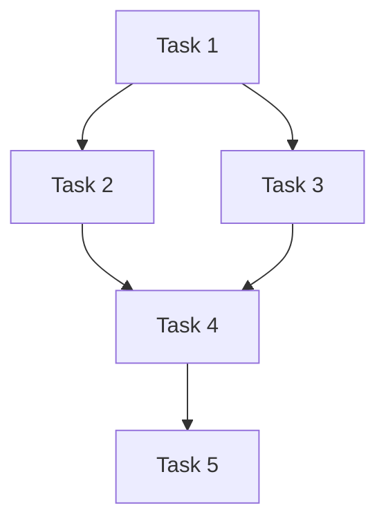
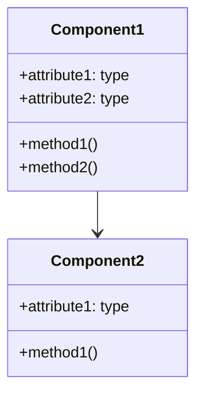

# Workplan: [Workplan Title]

## Document Information
- **Workplan ID**: [WP-XXX]
- **Project**: [Project Name]
- **Document Version**: [Version Number]
- **Last Updated**: [YYYY-MM-DD]
- **Author(s)**: [Author Names]
- **Status**: [Draft/In Review/Approved]
- **Approvers**: [Stakeholder Names]

## 1. Objective

### 1.1 Purpose
[Provide a clear, concise statement of what this workplan aims to achieve. This should be specific and focused on the implementation goal.]

### 1.2 Scope
[Define the boundaries of this workplan. What is included and what is explicitly excluded from this implementation chunk.]

### 1.3 Expected Outcomes
[List the specific deliverables and outcomes that will result from completing this workplan.]

- [Outcome 1]
- [Outcome 2]
- [Outcome 3]

## 2. Prerequisites

### 2.1 Dependencies
[List all dependencies that must be completed before this workplan can be implemented.]

| Dependency | Type | Status | Notes |
|------------|------|--------|-------|
| [Dependency 1] | [Technical/Resource/External] | [Not Started/In Progress/Complete] | [Additional information] |
| [Dependency 2] | [Technical/Resource/External] | [Not Started/In Progress/Complete] | [Additional information] |
| [Dependency 3] | [Technical/Resource/External] | [Not Started/In Progress/Complete] | [Additional information] |

### 2.2 Required Resources
[List all resources required to complete this workplan.]

| Resource | Type | Availability | Notes |
|----------|------|--------------|-------|
| [Resource 1] | [Personnel/Tool/Environment] | [Available/Pending] | [Additional information] |
| [Resource 2] | [Personnel/Tool/Environment] | [Available/Pending] | [Additional information] |
| [Resource 3] | [Personnel/Tool/Environment] | [Available/Pending] | [Additional information] |

### 2.3 Knowledge Requirements
[Specify any specialized knowledge or skills required to implement this workplan.]

- [Knowledge/Skill 1]
- [Knowledge/Skill 2]
- [Knowledge/Skill 3]

## 3. Detailed Tasks

### 3.1 Task Breakdown
[Break down the implementation into specific, actionable tasks. Each task should be small enough to be completed in a reasonable timeframe (e.g., 1-2 days).]

| Task ID | Task Description | Estimated Effort | Dependencies | Assignee |
|---------|------------------|------------------|--------------|----------|
| T1 | [Task 1 description] | [Hours/Story Points] | [Dependencies] | [Assignee] |
| T2 | [Task 2 description] | [Hours/Story Points] | [Dependencies] | [Assignee] |
| T3 | [Task 3 description] | [Hours/Story Points] | [Dependencies] | [Assignee] |
| T4 | [Task 4 description] | [Hours/Story Points] | [Dependencies] | [Assignee] |
| T5 | [Task 5 description] | [Hours/Story Points] | [Dependencies] | [Assignee] |

### 3.2 Task Sequence
[Describe the sequence in which tasks should be completed. Include any parallel work that can be done.]



### 3.3 Milestones
[Define key milestones for tracking progress.]

| Milestone | Description | Target Date | Tasks Completed |
|-----------|-------------|-------------|-----------------|
| M1 | [Milestone 1] | [Date] | [T1, T2] |
| M2 | [Milestone 2] | [Date] | [T3, T4] |
| M3 | [Milestone 3] | [Date] | [T5] |

## 4. Technical Specifications

### 4.1 Architecture Context
[Describe how this implementation fits into the overall system architecture. Reference relevant sections of the Architecture Document.]

### 4.2 Design Details
[Provide detailed design information specific to this implementation chunk. Include diagrams, data models, algorithms, etc. as appropriate.]

#### 4.2.1 Component Design
[Describe the design of the components to be implemented.]



#### 4.2.2 Data Models
[Describe any data models or structures that will be implemented.]

```typescript
interface ExampleInterface {
  property1: string;
  property2: number;
  property3?: boolean;
}

type ExampleType = {
  field1: string;
  field2: number[];
  field3: Record<string, any>;
};
```

#### 4.2.3 API Specifications
[Define any APIs that will be implemented or modified.]

```typescript
// Example API definition
function exampleFunction(param1: string, param2: number): Promise<Result> {
  // Implementation details
}

class ExampleClass {
  constructor(options: Options) {
    // Implementation details
  }
  
  public method1(param: Type): ReturnType {
    // Implementation details
  }
}
```

### 4.3 Technical Constraints
[List any technical constraints or limitations that must be considered during implementation.]

- [Constraint 1]
- [Constraint 2]
- [Constraint 3]

### 4.4 Dependencies on Other Components
[Describe how this implementation depends on other system components and how they interact.]

| Component | Interaction Type | Interface | Notes |
|-----------|------------------|-----------|-------|
| [Component 1] | [Uses/Extends/Implements] | [Interface description] | [Additional information] |
| [Component 2] | [Uses/Extends/Implements] | [Interface description] | [Additional information] |
| [Component 3] | [Uses/Extends/Implements] | [Interface description] | [Additional information] |

## 5. Testing Strategy

### 5.1 Testing Approach
[Describe the overall approach to testing this implementation.]

### 5.2 Test Cases
[List specific test cases that should be implemented to verify this implementation.]

| Test ID | Test Description | Test Type | Test Data | Expected Result |
|---------|------------------|-----------|-----------|-----------------|
| TC1 | [Test case 1] | [Unit/Integration/System] | [Test data] | [Expected result] |
| TC2 | [Test case 2] | [Unit/Integration/System] | [Test data] | [Expected result] |
| TC3 | [Test case 3] | [Unit/Integration/System] | [Test data] | [Expected result] |
| TC4 | [Test case 4] | [Unit/Integration/System] | [Test data] | [Expected result] |
| TC5 | [Test case 5] | [Unit/Integration/System] | [Test data] | [Expected result] |

### 5.3 Test Environment
[Describe the environment required for testing.]

### 5.4 Test Data
[Describe any test data that needs to be created or acquired.]

### 5.5 Performance Testing
[Describe any performance testing that should be conducted.]

## 6. Implementation Guidance

### 6.1 Best Practices
[Provide guidance on best practices to follow during implementation.]

- [Best practice 1]
- [Best practice 2]
- [Best practice 3]

### 6.2 Code Examples
[Provide example code snippets or references to similar implementations that can guide the developer.]

```typescript
// Example implementation
function exampleImplementation() {
  // Implementation details
}
```

### 6.3 Potential Challenges
[Identify potential challenges or pitfalls that might be encountered during implementation and how to address them.]

| Challenge | Impact | Mitigation Strategy |
|-----------|--------|---------------------|
| [Challenge 1] | [High/Medium/Low] | [Strategy to address] |
| [Challenge 2] | [High/Medium/Low] | [Strategy to address] |
| [Challenge 3] | [High/Medium/Low] | [Strategy to address] |

### 6.4 Security Considerations
[Highlight any security considerations that should be addressed during implementation.]

- [Security consideration 1]
- [Security consideration 2]
- [Security consideration 3]

### 6.5 Performance Considerations
[Highlight any performance considerations that should be addressed during implementation.]

- [Performance consideration 1]
- [Performance consideration 2]
- [Performance consideration 3]

## 7. Review Checklist

### 7.1 Implementation Review Criteria
[Define the criteria that will be used to review the implementation.]

- [ ] [Criterion 1]
- [ ] [Criterion 2]
- [ ] [Criterion 3]
- [ ] [Criterion 4]
- [ ] [Criterion 5]

### 7.2 Code Quality Standards
[Define the code quality standards that must be met.]

- [ ] [Standard 1]
- [ ] [Standard 2]
- [ ] [Standard 3]
- [ ] [Standard 4]
- [ ] [Standard 5]

### 7.3 Documentation Requirements
[Define the documentation that must be created or updated as part of this implementation.]

- [ ] [Documentation item 1]
- [ ] [Documentation item 2]
- [ ] [Documentation item 3]

### 7.4 Testing Verification
[Define how testing will be verified.]

- [ ] [Verification item 1]
- [ ] [Verification item 2]
- [ ] [Verification item 3]

## 8. Appendices

### 8.1 Glossary
[Define key terms and acronyms used in this document.]

| Term | Definition |
|------|------------|
| [Term 1] | [Definition] |
| [Term 2] | [Definition] |
| [Term 3] | [Definition] |

### 8.2 References
[List references to other documents, standards, or resources.]

- [Reference 1]
- [Reference 2]
- [Reference 3]

### 8.3 Revision History
[Track changes to this document over time.]

| Version | Date | Author | Description of Changes |
|---------|------|--------|------------------------|
| [Version] | [Date] | [Author] | [Description] |
| [Version] | [Date] | [Author] | [Description] |
| [Version] | [Date] | [Author] | [Description] |

---

## Notes on Using This Template

This Workplan template is designed to provide detailed implementation instructions for each chunk identified in the Project Overview. It follows the process outlined in the issue:

1. Select chunks from Project Overview
2. Break down each chunk into detailed tasks
3. Define technical specifications for each task
4. Develop testing strategies
5. Create implementation guidance
6. Define review criteria

When using this template:

1. **Start with the Project Overview**: Review the Project Overview document to understand how this chunk fits into the overall project.
2. **Be specific and detailed**: Provide enough detail that a developer can implement the chunk without needing to ask many questions.
3. **Include all necessary technical specifications**: Diagrams, data models, API specifications, etc.
4. **Define clear testing criteria**: Ensure that the implementation can be properly tested and verified.
5. **Provide helpful guidance**: Include best practices, code examples, and potential challenges.
6. **Set clear review criteria**: Define what a successful implementation looks like.

Remember that a good Workplan should:
- Provide clear, actionable tasks
- Include detailed technical specifications
- Define comprehensive testing strategies
- Offer practical implementation guidance
- Establish objective review criteria

